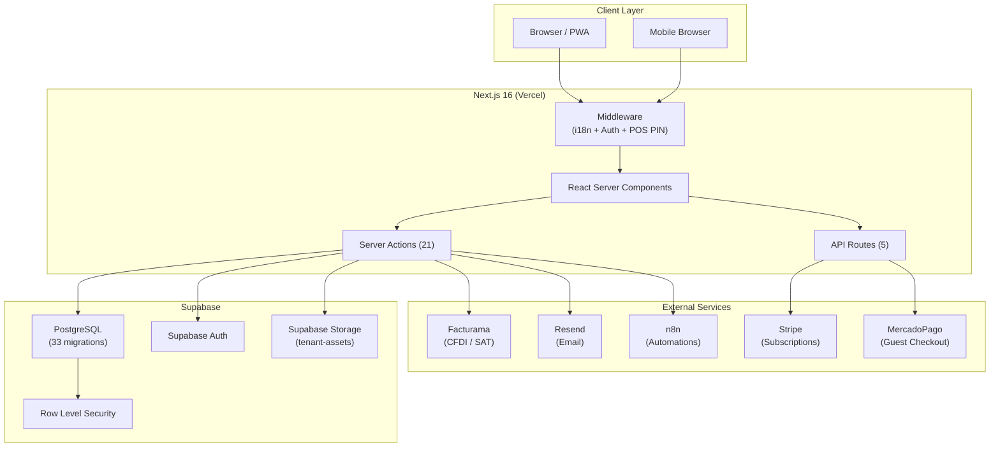

# 01 — Architecture Overview

## System Summary

**The Best of Monroe** is a multi-tenant SaaS platform for Mexican SMBs (small/medium businesses). It replaces the legacy **thebestofmexico.org** (Vite + PHP + MySQL) with a modern full-stack TypeScript platform.

**One-liner**: An all-in-one business operating system — POS, CRM, invoicing, directory, NFC hardware, and e-commerce — purpose-built for Mexican businesses.

---

## Tech Stack

| Layer | Technology | Version |
|---|---|---|
| **Framework** | Next.js (App Router) | 16.1.6 |
| **Language** | TypeScript (strict) | 5.x |
| **React** | React | 19.2.3 |
| **Database** | Supabase (PostgreSQL) | Hosted |
| **Auth** | Supabase Auth + `@supabase/ssr` | 0.9.x |
| **UI Library** | shadcn/ui + Radix Primitives | Latest |
| **Styling** | Tailwind CSS v4 | 4.x |
| **State** | Zustand + `persist` (IndexedDB via `idb-keyval`) | 5.x |
| **Toasts** | Sonner (via shadcn/ui) | 2.x |
| **Forms** | React Hook Form + Zod validation | 7.x |
| **i18n** | next-intl | 4.8.x |
| **Payments** | Stripe (subscriptions) + MercadoPago (guest checkout) | Latest |
| **Invoicing** | Facturama (CFDI 4.0 / SAT compliance) | REST API |
| **Email** | Resend + React Email templates | 6.x |
| **Maps** | Leaflet + react-leaflet | 1.9 / 5.0 |
| **Charts** | Recharts | 3.8 |
| **Tables** | TanStack Table | 8.21.x |
| **PWA** | Serwist (service worker) | 9.5.x |
| **Drag & Drop** | dnd-kit | v6+ |
| **Barcodes** | JsBarcode, react-zxing | Latest |
| **QR Codes** | qrcode.react | 4.x |
| **Hosting** | Vercel | Managed |
| **CI/CD** | GitHub Actions | 3-job pipeline |
| **Testing** | Vitest (unit) + Playwright (E2E) | Latest |

---

## Architecture Diagram



---

## Multi-Tenancy Model

The Best of Monroe uses a **single-database, row-level isolation** model:

1. Each `business` is a tenant with a unique `UUID`
2. Every data table has a `business_id` FK
3. Supabase RLS policies enforce data isolation at the database level
4. A helper function `auth.business_id()` extracts the caller's tenant from their JWT
5. Super-admins can bypass RLS via `auth.is_superadmin()`

```
auth.users (Supabase managed)
    └── public.users (1:1 via id FK)
          └── public.businesses (N:1 via business_id)
                ├── public.products
                ├── public.transactions
                ├── public.entities (polymorphic)
                ├── public.crm_customers
                ├── public.modules (feature flags)
                ├── public.nfc_tags
                └── ... (30+ tables)
```

---

## Project Structure

```
The Best of Monroe/
├── src/
│   ├── app/
│   │   ├── [locale]/              # i18n-wrapped routes
│   │   │   ├── (public)/          # Login, register, pricing, public profiles
│   │   │   ├── app/               # Back-office (14 modules)
│   │   │   ├── admin/             # Super-admin panel
│   │   │   ├── portal/            # Guest-facing portal
│   │   │   ├── checkout/          # Payment result pages
│   │   │   ├── directory/         # Public directory listing
│   │   │   ├── invoice/           # Public invoice viewer
│   │   │   ├── receipt/           # Receipt viewer (token-based)
│   │   │   ├── claim/             # NFC tag claiming
│   │   │   └── r/                 # URL redirects
│   │   └── api/                   # 5 API routes (webhooks, vcard, codi, health)
│   ├── components/                # 19 component files + 25 shadcn/ui primitives
│   ├── hooks/                     # 5 custom hooks
│   ├── stores/                    # 2 Zustand stores (cart, guest cart)
│   ├── lib/
│   │   ├── actions/               # 21 server actions
│   │   ├── auth/                  # Feature gating + RBAC
│   │   ├── queries/               # Dashboard data queries
│   │   ├── schemas/               # 6 Zod validation schemas
│   │   ├── security/              # AES-256-GCM encryption + permissions
│   │   ├── services/              # Email (Resend) + Facturama
│   │   ├── supabase/              # 6 client/server/middleware utilities
│   │   ├── sync/                  # Offline queue (IndexedDB)
│   │   ├── types/                 # TypeScript type definitions
│   │   └── utils/                 # Shared utilities
│   ├── emails/                    # React Email templates
│   ├── i18n/                      # i18n config (en, es)
│   ├── templates/                 # Report templates
│   └── middleware.ts              # Root middleware (i18n + auth + POS PIN)
├── e2e/                           # 4 Playwright E2E test files
├── supabase/                      # 33 migration files + seed + functions
├── messages/                      # en.json, es.json (translation files)
├── public/                        # Static assets
└── .github/workflows/             # CI/CD pipeline
```

---

## Request Flow

1. **Browser** → sends request
2. **Middleware** → handles i18n locale detection, Supabase session refresh, route protection
3. **React Server Component** → fetches data via Supabase client, renders HTML
4. **Server Action** → handles mutations (validated by Zod, authorized by RBAC/feature-gate)
5. **Supabase** → enforces RLS, returns data
6. **Client** → receives hydrated React tree, Zustand stores rehydrate from IndexedDB

---

## Deployment

- **Hosting**: Vercel (managed Next.js deployment)
- **Database**: Supabase (hosted PostgreSQL)
- **CI/CD**: GitHub Actions on push/PR to `main`
- **PWA**: Serwist generates a service worker (disabled in dev)
- **React Compiler**: Enabled via `reactCompiler: true` in next.config

---

## Legacy Project (thebestofmexico.org)

The legacy project is a Vite + React 19 SPA that served as the original platform. It uses:
- PHP 8 backend with MySQL
- React Router v6
- Cookie/session-based auth
- 50+ PHP API files
- 20 page components

**Status**: Fully replaced by The Best of Monroe. The legacy repo remains for reference only.
