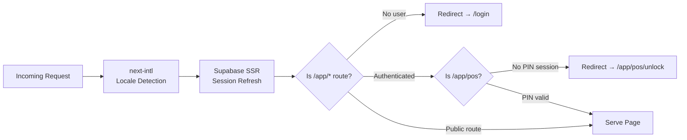

# 03 — Routes & API Reference

## Middleware Pipeline

Every non-API, non-static request passes through three middleware layers in [middleware.ts](file:///c:/antigravity/The Best of Monroe/src/middleware.ts):

**Matcher**: Excludes `api`, `_next/static`, `_next/image`, `favicon.ico`, `sw.js`, static assets.

---

## Page Routes (41 total)

### Public Routes `(public)/`

| Path | File | Description |
|---|---|---|
| `/[locale]` | [page.tsx](file:///c:/antigravity/The Best of Monroe/src/app/[locale]/page.tsx) | Landing / locale redirect |
| `/[locale]/login` | [(public)/login/page.tsx](file:///c:/antigravity/The Best of Monroe/src/app/[locale]/(public)/login/page.tsx) | Email/password login |
| `/[locale]/register` | [(public)/register/page.tsx](file:///c:/antigravity/The Best of Monroe/src/app/[locale]/(public)/register/page.tsx) | Business registration |
| `/[locale]/pricing` | [(public)/pricing/page.tsx](file:///c:/antigravity/The Best of Monroe/src/app/[locale]/(public)/pricing/page.tsx) | Subscription tiers |
| `/[locale]/b2b` | [(public)/b2b/page.tsx](file:///c:/antigravity/The Best of Monroe/src/app/[locale]/(public)/b2b/page.tsx) | B2B landing page |
| `/[locale]/[city]/[slug]` | [(public)/[city]/[slug]/page.tsx](file:///c:/antigravity/The Best of Monroe/src/app/[locale]/(public)/[city]/[slug]/page.tsx) | Public business profile |
| `/[locale]/forms/[id]` | [(public)/forms/[id]/page.tsx](file:///c:/antigravity/The Best of Monroe/src/app/[locale]/(public)/forms/[id]/page.tsx) | Public e-form |

### Protected Back-Office `app/`

| Path | File | Module |
|---|---|---|
| `/[locale]/app` | [app/page.tsx](file:///c:/antigravity/The Best of Monroe/src/app/[locale]/app/page.tsx) | Dashboard |
| `/[locale]/app/pos` | `app/pos/page.tsx` | POS Terminal |
| `/[locale]/app/pos/unlock` | `app/pos/unlock/page.tsx` | POS PIN Lock |
| `/[locale]/app/pos/gift-cards` | `app/pos/gift-cards/page.tsx` | Gift Card management |
| `/[locale]/app/inventory` | `app/inventory/page.tsx` | Inventory |
| `/[locale]/app/crm` | `app/crm/page.tsx` | CRM List |
| `/[locale]/app/crm/[customerId]` | `app/crm/[customerId]/page.tsx` | CRM Detail |
| `/[locale]/app/invoices` | `app/invoices/page.tsx` | Invoice management |
| `/[locale]/app/eforms` | `app/eforms/page.tsx` | E-Forms list |
| `/[locale]/app/eforms/create` | `app/eforms/create/page.tsx` | E-Form builder |
| `/[locale]/app/eforms/edit/[id]` | `app/eforms/edit/[id]/page.tsx` | E-Form editor |
| `/[locale]/app/links` | `app/links/page.tsx` | Smart Links |
| `/[locale]/app/keyrings` | `app/keyrings/page.tsx` | NFC Keyrings |
| `/[locale]/app/directory` | `app/directory/page.tsx` | Directory manager |
| `/[locale]/app/users` | `app/users/page.tsx` | Team management |
| `/[locale]/app/users/audit-logs` | `app/users/audit-logs/page.tsx` | Audit logs (owner only) |
| `/[locale]/app/automations` | `app/automations/page.tsx` | Automation configs |
| `/[locale]/app/theme` | `app/theme/page.tsx` | Theme editor |
| `/[locale]/app/vault` | `app/vault/page.tsx` | Data Vault |
| `/[locale]/app/settings` | `app/settings/page.tsx` | Business settings |
| `/[locale]/app/settings/billing` | `app/settings/billing/page.tsx` | SAT config |
| `/[locale]/app/settings/subscription` | `app/settings/subscription/page.tsx` | Stripe billing |
| `/[locale]/app/upgrade` | `app/upgrade/page.tsx` | Feature upgrade gate |

### Standalone Routes

| Path | File | Description |
|---|---|---|
| `/[locale]/portal` | `portal/page.tsx` | Guest-facing portal |
| `/[locale]/portal/login` | `portal/login/page.tsx` | Portal login |
| `/[locale]/admin` | `admin/page.tsx` | Super-admin dashboard |
| `/[locale]/admin/tenants` | `admin/tenants/page.tsx` | Tenant management |
| `/[locale]/directory` | `directory/page.tsx` | Public directory |
| `/[locale]/directory/[slug]` | `directory/[slug]/page.tsx` | Directory detail |
| `/[locale]/checkout/success` | `checkout/success/page.tsx` | Payment success |
| `/[locale]/checkout/failure` | `checkout/failure/page.tsx` | Payment failure |
| `/[locale]/checkout/pending` | `checkout/pending/page.tsx` | Payment pending |
| `/[locale]/claim` | `claim/page.tsx` | NFC tag claim |
| `/[locale]/invoice/[tx_id]` | `invoice/[tx_id]/page.tsx` | Public invoice request |
| `/[locale]/receipt/[token]` | `receipt/[token]/page.tsx` | Public receipt viewer |

---

## API Routes (5 endpoints)

| Method | Path | File | Auth | Purpose |
|---|---|---|---|---|
| `POST` | `/api/codi/generate` | [route.ts](file:///c:/antigravity/The Best of Monroe/src/app/api/codi/generate/route.ts) | None | Generate CoDi QR payment payload |
| `GET` | `/api/health` | `api/health/route.ts` | None | Health check |
| `GET` | `/api/vcard/[businessId]` | `api/vcard/[businessId]/route.ts` | None | Download vCard for a business |
| `POST` | `/api/webhooks/auth` | `api/webhooks/auth/route.ts` | Supabase webhook | Handle new user registration events |
| `POST` | `/api/webhooks/mercadopago` | `api/webhooks/mercadopago/route.ts` | HMAC sig | MercadoPago payment notification |
| `POST` | `/api/webhooks/stripe` | `api/webhooks/stripe/route.ts` | Stripe sig | Stripe subscription events |

---

## Server Actions (21 total)

All actions are in [src/lib/actions/](file:///c:/antigravity/The Best of Monroe/src/lib/actions/):

| File | Actions | Auth | Notes |
|---|---|---|---|
| `admin.ts` | Admin-level operations | Super-admin | Platform management |
| `analytics.ts` | Track analytics events | Business scoped | Click/view counting |
| `automations.ts` | `getAutomationConfigs`, `saveAutomationConfig`, `deleteAutomationConfig` | Session | n8n webhook configs |
| `crm.ts` | `createCustomer`, `updateCustomer`, `deleteCustomer`, `updateCustomerStatus`, `addCustomerNote`, `deleteCustomerNote` | Session | Full CRM CRUD |
| `crud.ts` | Generic entity CRUD | Session | Polymorphic entity table |
| `currency.ts` | Currency operations | Session | Multi-currency support |
| `eforms.ts` | E-form operations | Session | JSON Schema forms |
| `guest-checkout.ts` | `createGuestCheckoutPreference` | **None** (admin client) | MercadoPago preference creation |
| `inventory-bulk.ts` | Bulk CSV import | Permission-gated | Mass product creation |
| `inventory.ts` | `createMenuItem`, `updateMenuItem`, `deleteMenuItem`, `getMenuItems` | `can_manage_inventory` | Activity-logged |
| `invoices.ts` | `submitInvoiceRequest` | Admin client | Facturama CFDI stamping (background) |
| `keyrings.ts` | `claimNfcTag`, `updateNfcTag` | Session | NFC hardware management |
| `links.ts` | `createLink`, `updateLink`, `deleteLink`, `reorderLinks` | Session | Polymorphic entities |
| `pin-auth.ts` | POS PIN operations | Session | Shift-based auth |
| `pos.ts` | `processTransaction` | Session | Loyalty + stock deduction |
| `sat-config.ts` | `updateSatConfig` | Owner/Manager | AES-256-GCM encrypted |
| `storage.ts` | File upload operations | Session | Supabase Storage |
| `stripe.ts` | `createCheckoutSession`, `createCustomerPortal` | Session | Subscription billing |
| `team.ts` | `getTeamMembers`, `updateUserRole`, `inviteTeamMember`, `removeTeamMember`, `updateUserPermissions` | Owner (RBAC) | Uses admin API for invites |
| `vault.ts` | Data vault operations | Session | Form submissions |
| `whatsapp.ts` | WhatsApp integration | Session | Messaging |

---

## Layouts (6 total)

| File | Scope | Features |
|---|---|---|
| `src/app/layout.tsx` | Root | Fonts, metadata |
| `src/app/[locale]/layout.tsx` | Locale | i18n provider, theme, PWA, toaster |
| `src/app/[locale]/app/layout.tsx` | Back-office | Sidebar, header, auth check |
| `src/app/[locale]/admin/layout.tsx` | Admin | Admin-specific layout |
| `src/app/[locale]/app/pos/layout.tsx` | POS | POS-specific layout |
| `src/app/[locale]/app/invoices/layout.tsx` | Invoices | Invoices layout |
