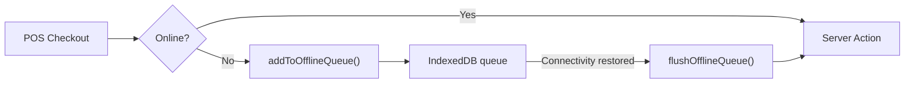
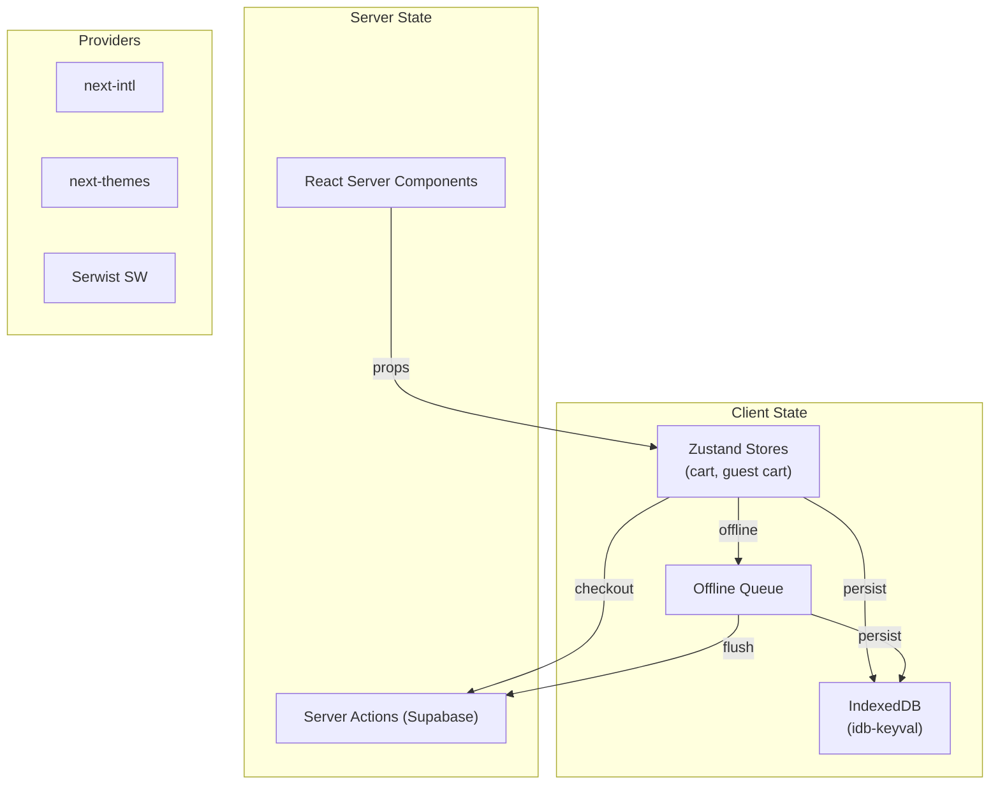

# 05 — State Management & Client-Side Architecture

## State Management Overview

The Best of Monroe uses a **minimal client-state** strategy. Most data lives on the server (Supabase), fetched via RSC and mutated via Server Actions. Client-side state is only used for:

1. **POS Cart** — must survive page refreshes and work offline
2. **Guest Cart** — for unauthenticated portal shoppers
3. **Offline Queue** — transactions queued when network is down

---

## Zustand Stores

### 1. POS Cart Store

**File**: [use-cart-store.ts](file:///c:/antigravity/The Best of Monroe/src/stores/use-cart-store.ts) (2,884 bytes)

**Purpose**: In-store POS cart that survives page refreshes and mobile browser memory purges.

| Field | Type | Description |
|---|---|---|
| `items` | `CartItem[]` | Cart line items (`entityId`, `name`, `price`, `quantity`) |
| `addItem()` | Method | Add or increment item quantity |
| `removeItem()` | Method | Remove by entityId |
| `updateQuantity()` | Method | Set specific quantity (auto-remove if ≤ 0) |
| `clearCart()` | Method | Empty cart |
| `subtotal()` | Computed | Sum of `price × quantity` |
| `tax()` | Computed | `subtotal × 0.16` (IVA) |
| `total()` | Computed | `subtotal + tax` |

**Persistence**: Uses `zustand/middleware/persist` with a custom **IndexedDB adapter** (via `idb-keyval`):

```
IndexedDB → keyval-store → "tbm-pos-cart"
```

> [!IMPORTANT]
> Only `items` are persisted (via `partialize`). Computed values recalculate on hydration.

### 2. Guest Cart Store

**File**: [use-guest-cart-store.ts](file:///c:/antigravity/The Best of Monroe/src/stores/use-guest-cart-store.ts) (1,891 bytes)

**Purpose**: Cart for unauthenticated users viewing a business portal (guest checkout via MercadoPago).

Same API as POS cart but without POS-specific features. Separate IndexedDB key to avoid conflicts.

---

## Offline Transaction Queue

**File**: [offline-queue.ts](file:///c:/antigravity/The Best of Monroe/src/lib/sync/offline-queue.ts) (2,380 bytes)

When the POS device loses connectivity, transactions are queued to IndexedDB and flushed when restored:



| Function | Purpose |
|---|---|
| `addToOfflineQueue()` | Queue a pending transaction |
| `getOfflineQueue()` | List all pending transactions |
| `removeFromQueue()` | Remove single processed tx |
| `clearOfflineQueue()` | Clear all pending |
| `flushOfflineQueue(processFn)` | Retry all — returns `{synced, failed}` |

---

## Custom Hooks

### State-Related Hooks

| Hook | File | Purpose |
|---|---|---|
| `useHydration` | [use-hydration.ts](file:///c:/antigravity/The Best of Monroe/src/hooks/use-hydration.ts) | Prevents hydration mismatch by waiting for Zustand store rehydration from IndexedDB |
| `useInventorySync` | [use-inventory-sync.ts](file:///c:/antigravity/The Best of Monroe/src/hooks/use-inventory-sync.ts) | Real-time inventory sync hook |
| `useMobile` | [use-mobile.ts](file:///c:/antigravity/The Best of Monroe/src/hooks/use-mobile.ts) | Viewport detection for responsive behavior |

### Input Hooks

| Hook | File | Purpose |
|---|---|---|
| `useHidScanner` | [use-hid-scanner.ts](file:///c:/antigravity/The Best of Monroe/src/hooks/use-hid-scanner.ts) | Listens for HID device input (RFID/barcode readers). Buffers keypresses, fires on Enter when buffer > 3 chars |
| `useBarcodeScanner` | [use-barcode-scanner.ts](file:///c:/antigravity/The Best of Monroe/src/hooks/use-barcode-scanner.ts) | Camera-based barcode scanning via `react-zxing` |

---

## Context Providers

These wrap the app at the locale layout level:

| Provider | Source | Purpose |
|---|---|---|
| `NextIntlClientProvider` | `next-intl` | i18n message injection |
| `ThemeProvider` | `next-themes` | Dark/light mode |
| `TooltipProvider` | Radix UI | Tooltip accessibility |
| `SidebarProvider` | shadcn/ui | Sidebar open/close state |
| `PwaRegistry` | Custom | Service worker registration |
| `Toaster` | Sonner | Toast notification rendering |

---

## State Flow Diagram


