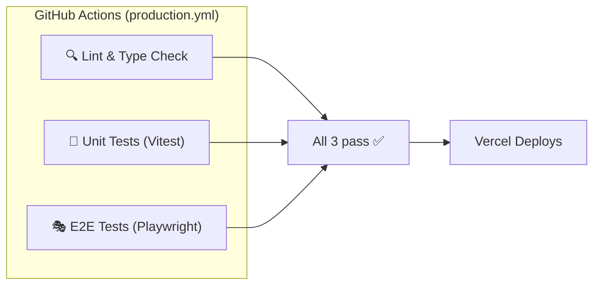

# 07 — Testing & CI/CD

## CI/CD Pipeline

**File**: [.github/workflows/production.yml](file:///c:/antigravity/The Best of Monroe/.github/workflows/production.yml)

> [!TIP]
> **Current Status (March 2026)**: All 3 CI jobs are **passing** ✅ after the latest merge.

**Trigger**: Push to `main`, PRs targeting `main`, manual dispatch



### Job 1: Lint & Type Check
- `npm run lint` → ESLint 9 with `eslint-config-next`
- `npx tsc --noEmit` → TypeScript strict mode

### Job 2: Unit Tests
- `npx vitest run --reporter=verbose`
- Uses `jsdom` environment, `fake-indexeddb` for store tests

### Job 3: E2E Tests
- Builds production bundle (`npm run build`)
- Starts Next.js server (`npx next start -H 127.0.0.1`)
- Runs `npx playwright test` (Chromium only)
- Uploads HTML report as artifact (14-day retention)
- **Requires 6 secrets**: `NEXT_PUBLIC_SUPABASE_URL`, `NEXT_PUBLIC_SUPABASE_ANON_KEY`, `SUPABASE_SERVICE_ROLE_KEY`, `E2E_USER_EMAIL`, `E2E_USER_PASSWORD`, `E2E_USER_B_EMAIL`, `E2E_USER_B_PASSWORD`

---

## E2E Tests (Playwright)

**Config**: [playwright.config.ts](file:///c:/antigravity/The Best of Monroe/playwright.config.ts)

| Setting | Value |
|---|---|
| Test directory | `./e2e` |
| Parallel | Yes |
| Retries (CI) | 2 |
| Workers (CI) | 1 |
| Browser | Chromium |
| webServer | Next.js (`start` in CI, `dev` locally) |
| Timeout (webServer) | 5 minutes |
| Traces | Always on |
| Screenshots | Always on |

### Auth Setup
- **Global setup**: [e2e/global-setup.ts](file:///c:/antigravity/The Best of Monroe/e2e/global-setup.ts) logs in two test users and saves session state to `e2e/.auth/user-a.json`
- All tests inherit this authenticated state

### Test Files (4)

| File | Tests | What It Validates |
|---|---|---|
| [auth.spec.ts](file:///c:/antigravity/The Best of Monroe/e2e/auth.spec.ts) | 3 | Auth redirect, session cookies, unauthenticated redirect |
| [pos-checkout.spec.ts](file:///c:/antigravity/The Best of Monroe/e2e/pos-checkout.spec.ts) | 4 | Grid loads, add to cart, persistence after reload, full checkout |
| [tenant-isolation.spec.ts](file:///c:/antigravity/The Best of Monroe/e2e/tenant-isolation.spec.ts) | — | Multi-tenant data isolation |
| [global-setup.ts](file:///c:/antigravity/The Best of Monroe/e2e/global-setup.ts) | — | Auth setup fixture |

### POS E2E Flow Detail

The POS checkout test is the most complex:
1. Navigate to `/es/app/pos`
2. Handle PIN unlock screen (enters `0000`)
3. Wait for hydration indicators (`pos-hydrating` → `pos-ready`)
4. Click product card → verify cart updates
5. Reload → verify IndexedDB persistence
6. Click checkout → verify success toast or empty cart

---

## Unit Tests (Vitest)

**Config**: [vitest.config.ts](file:///c:/antigravity/The Best of Monroe/vitest.config.ts)

| Setting | Value |
|---|---|
| Environment | `jsdom` |
| Setup file | `vitest.setup.ts` |
| Test pattern | Standard (`**/*.test.ts`, `**/__tests__/*.ts`) |

### Known Test Directories

| Directory | Tests |
|---|---|
| `src/stores/__tests__/` | Cart store unit tests |
| `src/lib/schemas/__tests__/` | Zod schema validation tests |
| `src/lib/security/__tests__/` | Encryption/permissions tests |

---

## Test Coverage Gaps

> [!CAUTION]
> The following areas have **no automated tests**:

| Area | Risk | Recommendation |
|---|---|---|
| Server Actions (21 files) | **High** | Add integration tests with Supabase test instance |
| CRM CRUD operations | **Medium** | Unit test with mocked Supabase client |
| Invoice/CFDI flow | **High** | Mock Facturama API, test status transitions |
| Stripe webhook handler | **High** | Test signature validation + subscription updates |
| MercadoPago webhook | **High** | Test HMAC verification + transaction status updates |
| Team invite (admin API) | **Medium** | Test RBAC enforcement |
| Feature gate logic | **Medium** | Test module config parsing |
| Offline queue flush | **Medium** | Test with `fake-indexeddb` |
| Multi-locale rendering | **Low** | Snapshot tests for en/es |

---

## Environment Variables for Tests

| Variable | Used By | Required For |
|---|---|---|
| `E2E_USER_EMAIL` | global-setup.ts | Playwright login |
| `E2E_USER_PASSWORD` | global-setup.ts | Playwright login |
| `E2E_USER_B_EMAIL` | global-setup.ts | Second user (tenant isolation) |
| `E2E_USER_B_PASSWORD` | global-setup.ts | Second user |
| `NEXT_PUBLIC_SUPABASE_URL` | E2E + build | Supabase connection |
| `NEXT_PUBLIC_SUPABASE_ANON_KEY` | E2E + build | Supabase auth |
| `SUPABASE_SERVICE_ROLE_KEY` | E2E | Admin operations in tests |

---

## Running Tests Locally

```bash
# Unit tests
npm run test           # or: npx vitest run

# E2E tests (requires dev server running)
npm run test:e2e       # or: npx playwright test

# E2E with UI
npm run test:e2e:ui    # or: npx playwright test --ui

# Lint
npm run lint

# Type check
npm run typecheck
```
