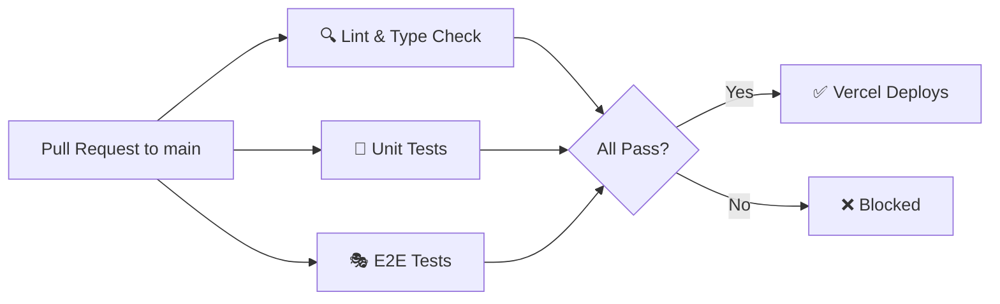

# Phase 5 Master Guide — CI/CD, Testing & Migration Infrastructure

> **The Best of Monroe** · Next.js 16 / Supabase · Production Readiness Layer

---

## 1. Executive Summary

Phase 5 establishes the three critical DevOps pillars that were missing from the The Best of Monroe stack:

| Pillar | Technology | Status |
|---|---|---|
| **Database Migrations** | Supabase CLI (`supabase/migrations/`) | ✅ Baseline captured |
| **E2E Testing** | Playwright (Chromium) | ✅ 11 tests across 3 suites |
| **CI/CD Pipeline** | GitHub Actions → Vercel | ✅ 3-job workflow |

**Key constraint enforced:** No manual SQL in production. No deployment without passing lint, type‑check, unit, and E2E gates.

---

## 2. Supabase Migration Workflow

### 2.1 Directory Structure

```
supabase/
├── config.toml                          # CLI configuration (project ID, ports)
├── seed.sql                             # Test data for local dev & E2E
├── .gitignore                           # Ignore local dev artifacts
└── migrations/
    └── 00000000000000_baseline.sql      # Full initial schema snapshot
```

### 2.2 How to Create a New Migration

```bash
# 1. Generate a timestamped migration file
npx supabase migration new <descriptive_name>
# Creates: supabase/migrations/<timestamp>_<descriptive_name>.sql

# 2. Write your DDL in the generated file
# Example: ALTER TABLE entities ADD COLUMN tags TEXT[];

# 3. Test locally (requires Docker)
npx supabase db reset        # Replays all migrations from scratch
npx supabase db diff          # Compare local vs remote schema

# 4. Push to production
npx supabase db push --project-ref amrqoakoyknuozwlftuf
```

### 2.3 Type Generation

After any schema change, regenerate TypeScript types:

```bash
npm run types:generate
# Output → src/lib/database.types.ts
```

### 2.4 Golden Rules

1. **Never** run raw SQL in the Supabase Dashboard for schema changes.
2. **Always** create a migration file, even for small changes (e.g., adding an index).
3. **Test locally** with `supabase db reset` before pushing to production.
4. **Commit** the migration file alongside the code that uses the new schema.

---

## 3. Testing Strategy

### 3.1 Test Pyramid

```
        ┌──────────┐
        │   E2E    │  Playwright (11 tests)
        │ (slow)   │  Full browser, real Supabase
        ├──────────┤
        │  Unit    │  Vitest (4 tests)
        │ (fast)   │  Zustand stores, pure logic
        └──────────┘
```

### 3.2 Available Scripts

| Script | Command | Description |
|---|---|---|
| `npm test` | `vitest run` | Run all unit tests |
| `npm run test:unit` | `vitest run` | Run unit tests (alias) |
| `npm run test:e2e` | `playwright test` | Run E2E suite |
| `npm run test:e2e:ui` | `playwright test --ui` | Interactive E2E UI |

### 3.3 E2E Test Matrix

| Suite | File | Tests | Description |
|---|---|---|---|
| **Auth Flow** | `e2e/auth.spec.ts` | 3 | Login redirect, session cookies, unauthenticated guard |
| **POS Checkout** | `e2e/pos-checkout.spec.ts` | 4 | Grid load, cart add, IndexedDB persistence, transaction creation |
| **Tenant Isolation** | `e2e/tenant-isolation.spec.ts` | 4 | Cross-tenant data isolation via RLS (requires User B credentials) |

### 3.4 Playwright Configuration Highlights

| Setting | Value | Rationale |
|---|---|---|
| Browser | Chromium only | Minimizes CI time; covers 80% of users |
| Auth strategy | `storageState` persisted via `global-setup.ts` | Login once, reuse session across all tests |
| Web server | `npm run dev` auto-start | No manual server management needed |
| Retries | 0 local / 2 in CI | Catches flaky tests in CI without slowing local dev |
| Reporter | `html` local / `github` in CI | Rich local reports, inline CI annotations |

### 3.5 E2E Setup — First Time

```bash
# 1. Install dependencies
npm install

# 2. Install Chromium browser binary
npx playwright install chromium

# 3. Create test users in Supabase Auth Dashboard:
#    - User A: belongs to Business A
#    - User B: belongs to Business B (different tenant)

# 4. Set environment variables in .env.local:
E2E_USER_EMAIL=usera@test.com
E2E_USER_PASSWORD=test-password-a
E2E_USER_B_EMAIL=userb@test.com
E2E_USER_B_PASSWORD=test-password-b

# 5. Run E2E tests
npm run test:e2e
```

---

## 4. CI/CD Pipeline Details

### 4.1 Workflow File

**Path:** `.github/workflows/production.yml`  
**Trigger:** Every `pull_request` targeting `main`

### 4.2 Job Architecture



### 4.3 Job Breakdown

#### Job 1: Lint & Type Check
```yaml
Steps:
  1. Checkout code
  2. Setup Node.js 20 + npm cache
  3. npm ci
  4. npm run lint        # ESLint (next core-web-vitals + typescript)
  5. npx tsc --noEmit    # Full type check
```

#### Job 2: Unit Tests
```yaml
Steps:
  1. Checkout code
  2. Setup Node.js 20 + npm cache
  3. npm ci
  4. npx vitest run --reporter=verbose
```

#### Job 3: E2E Tests
```yaml
Steps:
  1. Checkout code
  2. Setup Node.js 20 + npm cache
  3. npm ci
  4. npx playwright install chromium --with-deps
  5. npm run build           # Production build for realistic testing
  6. npx playwright test     # Run all E2E suites
  7. Upload playwright-report/ as artifact (on failure)
```

### 4.4 Required GitHub Secrets

These must be configured in **GitHub → Settings → Secrets and Variables → Actions**:

| Secret | Source | Purpose |
|---|---|---|
| `NEXT_PUBLIC_SUPABASE_URL` | `.env.local` line 2 | Supabase API endpoint |
| `NEXT_PUBLIC_SUPABASE_ANON_KEY` | `.env.local` line 3 | Public API key |
| `SUPABASE_SERVICE_ROLE_KEY` | `.env.local` line 4 | Admin API key (E2E seed) |
| `E2E_USER_EMAIL` | Test user email | Playwright auth (User A) |
| `E2E_USER_PASSWORD` | Test user password | Playwright auth (User A) |
| `E2E_USER_B_EMAIL` | Test user email | Playwright auth (User B) |
| `E2E_USER_B_PASSWORD` | Test user password | Playwright auth (User B) |

### 4.5 Vercel Integration

Vercel auto-deploys on push to `main` by default. The GitHub Actions workflow acts as a **quality gate**:

1. Developer opens a PR to `main`.
2. GitHub Actions runs all 3 jobs in parallel.
3. If **any job fails**, the PR cannot be merged (requires branch protection rules).
4. Once merged, Vercel deploys automatically.

**To enable this:**
1. Go to GitHub repo → **Settings → Branches → Branch protection rules**.
2. Add a rule for `main`:
   - ✅ Require status checks to pass before merging
   - Select: `🔍 Lint & Type Check`, `🧪 Unit Tests`, `🎭 E2E Tests`

---

## 5. File Manifest

All files created or modified in Phase 5:

| Action | File |
|---|---|
| **NEW** | `supabase/config.toml` |
| **NEW** | `supabase/migrations/00000000000000_baseline.sql` |
| **NEW** | `supabase/seed.sql` |
| **NEW** | `supabase/.gitignore` |
| **NEW** | `playwright.config.ts` |
| **NEW** | `e2e/global-setup.ts` |
| **NEW** | `e2e/auth.spec.ts` |
| **NEW** | `e2e/pos-checkout.spec.ts` |
| **NEW** | `e2e/tenant-isolation.spec.ts` |
| **NEW** | `.github/workflows/production.yml` |
| **MODIFIED** | `package.json` (scripts + `@playwright/test` dep) |
| **MODIFIED** | `.gitignore` (Playwright + generated types) |
| **MODIFIED** | `tsconfig.json` (exclude `e2e/` + `playwright.config.ts`) |

---

## 6. Quick Reference Commands

```bash
# --- Development ---
npm run dev                     # Start dev server
npm run types:generate          # Regenerate DB types from Supabase

# --- Testing ---
npm test                        # Unit tests (vitest)
npm run test:e2e                # E2E tests (playwright)
npm run test:e2e:ui             # Interactive E2E browser

# --- Quality ---
npm run lint                    # ESLint
npm run typecheck               # TypeScript check

# --- Migrations ---
npx supabase migration new <name>    # Create new migration
npx supabase db reset                # Reset local DB
npx supabase db push                 # Push to production
```
