# UI Audit Report — The Best of Monroe

> **Date:** 2026-03-13
> **App Version:** N/A
> **Base URL:** http://localhost:3000

---

## Executive Summary

| Metric | Count |
|--------|-------|
| Total pages audited | 34 |
| ✅ Pages loaded successfully | 24 |
| ↪️ Pages redirected | 6 |
| ❌ Pages with errors | 4 |
| ⏱️ Pages timed out | 0 |
| Total buttons found | 1025 |
| Total links found | 14 |
| Total form inputs found | 37 |
| Disabled buttons | 4 |
| Broken images | 0 |
| Console errors detected | 13 |

---

## Route Inventory

| # | Route | Status | Title | Buttons | Links | Inputs | Console Errs |
|---|-------|--------|-------|---------|-------|--------|--------------|
| 1 | `/es/login` | loaded | The Best of Monroe — The Best of Mexico | 1 | 1 | 2 | 0 |
| 2 | `/es/pricing` | loaded | The Best of Monroe — The Best of Mexico | 2 | 0 | 0 | 0 |
| 3 | `/es/forgot-password` | loaded | The Best of Monroe — The Best of Mexico | 1 | 1 | 1 | 0 |
| 4 | `/es/b2b` | redirect | The Best of Monroe — The Best of Mexico | 2 | 0 | 0 | 0 |
| 5 | `/es/directory` | loaded | The Best of Monroe — The Best of Mexico | 12 | 4 | 0 | 0 |
| 6 | `/es/app` | loaded | The Best of Monroe — The Best of Mexico | 186 | 0 | 0 | 0 |
| 7 | `/es/app/pos` | redirect | The Best of Monroe — The Best of Mexico | 29 | 0 | 0 | 0 |
| 8 | `/es/app/pos/unlock` | loaded | The Best of Monroe — The Best of Mexico | 29 | 0 | 0 | 0 |
| 9 | `/es/app/pos/gift-cards` | redirect | The Best of Monroe — The Best of Mexico | 29 | 0 | 0 | 0 |
| 10 | `/es/app/crm` | loaded | The Best of Monroe — The Best of Mexico | 20 | 0 | 1 | 2 |
| 11 | `/es/app/inventory` | loaded | The Best of Monroe — The Best of Mexico | 40 | 0 | 1 | 2 |
| 12 | `/es/app/eforms` | loaded | The Best of Monroe — The Best of Mexico | 19 | 3 | 0 | 0 |
| 13 | `/es/app/eforms/create` | loaded | The Best of Monroe — The Best of Mexico | 25 | 1 | 1 | 2 |
| 14 | `/es/app/vault` | loaded | The Best of Monroe — The Best of Mexico | 21 | 0 | 0 | 0 |
| 15 | `/es/app/directory` | loaded | The Best of Monroe — The Best of Mexico | 19 | 0 | 1 | 0 |
| 16 | `/es/app/links` | loaded | The Best of Monroe — The Best of Mexico | 19 | 0 | 0 | 1 |
| 17 | `/es/app/links/analytics` | loaded | The Best of Monroe — The Best of Mexico | 18 | 0 | 0 | 0 |
| 18 | `/es/app/keyrings` | loaded | The Best of Monroe — The Best of Mexico | 19 | 0 | 0 | 1 |
| 19 | `/es/app/users` | error |  | 0 | 0 | 0 | 1 |
| 20 | `/es/app/users/audit-logs` | loaded | The Best of Monroe — The Best of Mexico | 18 | 0 | 0 | 0 |
| 21 | `/es/app/invoices` | redirect | The Best of Monroe — The Best of Mexico | 20 | 2 | 0 | 0 |
| 22 | `/es/app/automations` | loaded | The Best of Monroe — The Best of Mexico | 23 | 0 | 2 | 0 |
| 23 | `/es/app/theme` | loaded | The Best of Monroe — The Best of Mexico | 20 | 0 | 2 | 0 |
| 24 | `/es/app/settings` | loaded | The Best of Monroe — The Best of Mexico | 20 | 0 | 18 | 0 |
| 25 | `/es/app/settings/billing` | loaded | The Best of Monroe — The Best of Mexico | 19 | 0 | 5 | 0 |
| 26 | `/es/app/settings/subscription` | loaded | The Best of Monroe — The Best of Mexico | 20 | 0 | 0 | 1 |
| 27 | `/es/app/upgrade` | loaded | The Best of Monroe — The Best of Mexico | 20 | 2 | 0 | 0 |
| 28 | `/es/admin` | redirect | The Best of Monroe — The Best of Mexico | 186 | 0 | 0 | 0 |
| 29 | `/es/admin/tenants` | redirect | The Best of Monroe — The Best of Mexico | 186 | 0 | 0 | 0 |
| 30 | `/es/checkout/success` | error |  | 0 | 0 | 0 | 1 |
| 31 | `/es/checkout/pending` | error |  | 0 | 0 | 0 | 1 |
| 32 | `/es/checkout/failure` | error |  | 0 | 0 | 0 | 1 |
| 33 | `/es/claim` | loaded | The Best of Monroe — The Best of Mexico | 1 | 0 | 2 | 0 |
| 34 | `/es/portal/login` | loaded | The Best of Monroe — The Best of Mexico | 1 | 0 | 1 | 0 |

---

## Page-by-Page Findings

### 1. `/es/login`

**Status:** loaded

**Screenshot:** 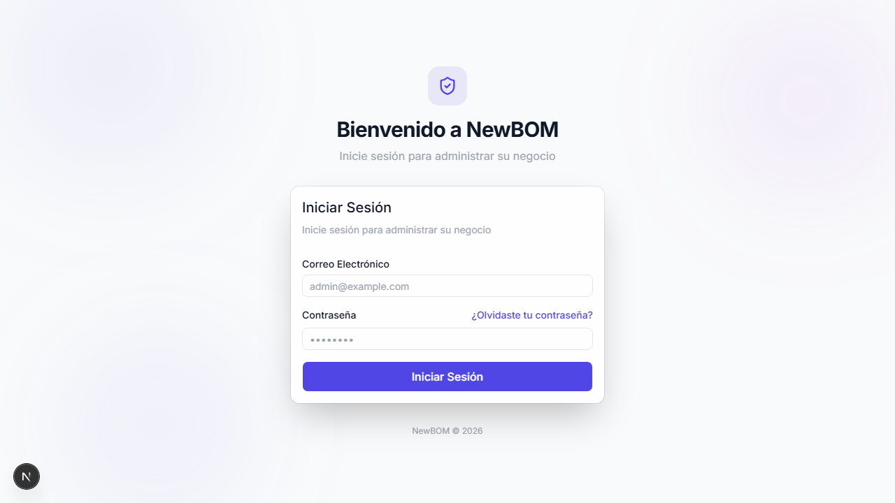

**Components Found:**
- Buttons: 1 (0 disabled)
- Links: 1
- Inputs: 2
- Selects: 0
- Modals: 0
- Tabs: 0
- Tables: 0

**Interactive Deep-Dive Notes (Phase 2):**
- **Validation:** Browser-native validation works; generic toast notification handles forced invalid submissions.
- **Forgot Password Link:** Works correctly, navigates to `/es/forgot-password` and back.
- **Login Flow:** Valid login successfully redirects to `/es/app` and validates session (sidebar appears).
- **Sidebar Check:** Properly hidden on the unauthenticated login page.

**Verified Issues:**
| Severity | Component | Description | Expected Behavior |
|----------|-----------|-------------|-------------------|
| 🔵 P3 | Form Validation | Missing custom inline form validation; relies on browser tooltips and general toasts. | Add inline validation errors (e.g., "Email is required"). |

---

### 2. `/es/pricing`

**Status:** loaded

**Screenshot:** 

**Components Found:**
- Buttons: 2 (0 disabled)
- Links: 0
- Inputs: 0
- Selects: 0
- Modals: 0
- Tabs: 0
- Tables: 0

**Interactive Deep-Dive Notes (Phase 2):**
- **Billing Toggle:** Missing. Only a single monthly Enterprise tier is displayed.
- **CTAs:** Both "Request Pilot" and "Schedule via WhatsApp" buttons are completely non-functional (no navigation, no modals, no network requests).
- **Layout:** Missing site footer. 
- **Translations:** Total failure. The page is entirely in English despite being on the `/es/` route.

**Verified Issues:**
| Severity | Component | Description | Expected Behavior |
|----------|-----------|-------------|-------------------|
| 🔴 P0 | All Content | Missing translations; content is 100% English on `/es/` route. | Content should be in Spanish. |
| 🟠 P1 | CTA Buttons | "Request Pilot" and "WhatsApp" buttons do absolutely nothing when clicked. | CTAs should navigate or open modals. |
| 🟡 P2 | Pricing Cards | Only one tier is present; no toggle. | Ensure this matches business requirements. |
| 🔵 P3 | Layout | Missing footer. | Add footer. |

---

### 3. `/es/forgot-password`

**Status:** loaded

**Screenshot:** 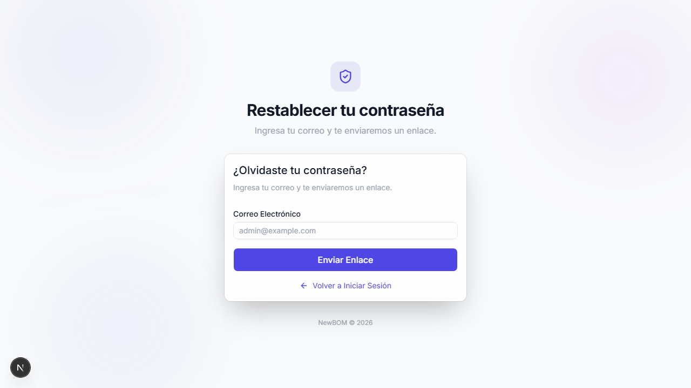

**Components Found:**
- Buttons: 1 (0 disabled)
- Links: 1
- Inputs: 1
- Selects: 0
- Modals: 0
- Tabs: 0
- Tables: 0

**Interactive Deep-Dive Notes (Phase 2):**
- **Validation:** Empty email triggers browser-native validation ("Please fill out this field").
- **Error Handling:** Non-existent email triggers a toast ("Email address is invalid").
- **Success State:** Valid email correctly triggers a success toast in Spanish ("Revisa tu correo para el enlace de recuperación").
- **Translations:** Full Spanish translation is implemented correctly.
- **Navigation:** The "Volver a Iniciar Sesión" button correctly navigates back to login.

**Verified Issues:**
| Severity | Component | Description | Expected Behavior |
|----------|-----------|-------------|-------------------|
| 🔵 P3 | Form Validation | Missing custom inline validation; relies on browser tooltips. | Add inline validation errors. |
| 🔵 P3 | Security UX | Error toast explicitly says email is invalid/doesn't exist. | Use generic message ("If email exists, a link was sent") to prevent user enumeration. |

---

### 4. `/es/b2b`

**Status:** redirect

**Screenshot:** 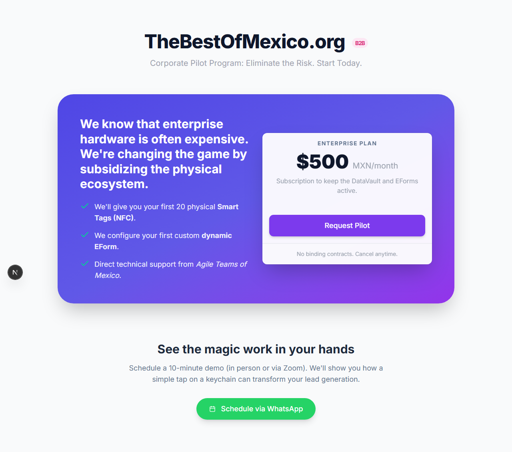

**Components Found:**
- Buttons: 2 (0 disabled)
- Links: 0
- Inputs: 0
- Selects: 0
- Modals: 0
- Tabs: 0
- Tables: 0

**Interactive Deep-Dive Notes (Phase 2):**
- **Search:** The search bar is entirely missing from the page layout.
- **Translations:** The page is almost entirely in English despite the `/es/` route (e.g., "Discover Local Businesses", category names).
- **Navigation:** Clicking "Explore" on a business card successfully navigates to the detail page.
- **Business Detail Page:** Shows duplicated text in menu items (e.g., "Tacos al PastorTacos al Pastor") and potential data formatting issues (e.g., price `$1515.00`).

**Verified Issues:**
| Severity | Component | Description | Expected Behavior |
|----------|-----------|-------------|-------------------|
| 🔴 P0 | Layout | Missing search bar entirely. | A search bar should be present for finding businesses. |
| 🔴 P0 | All Content | Missing translations; content is mostly English on `/es/` route. | Content should be in Spanish. |
| 🟠 P1 | Business Detail | Duplicated text in menu items (e.g. "ItemItem"). | Ensure text is not duplicated. |
| 🟡 P2 | Business Detail | Price formatting appears broken (e.g., `$1515.00`). | Verify data injection and formatting. |

---

### 5. `/es/directory`

**Status:** loaded

**Screenshot:** 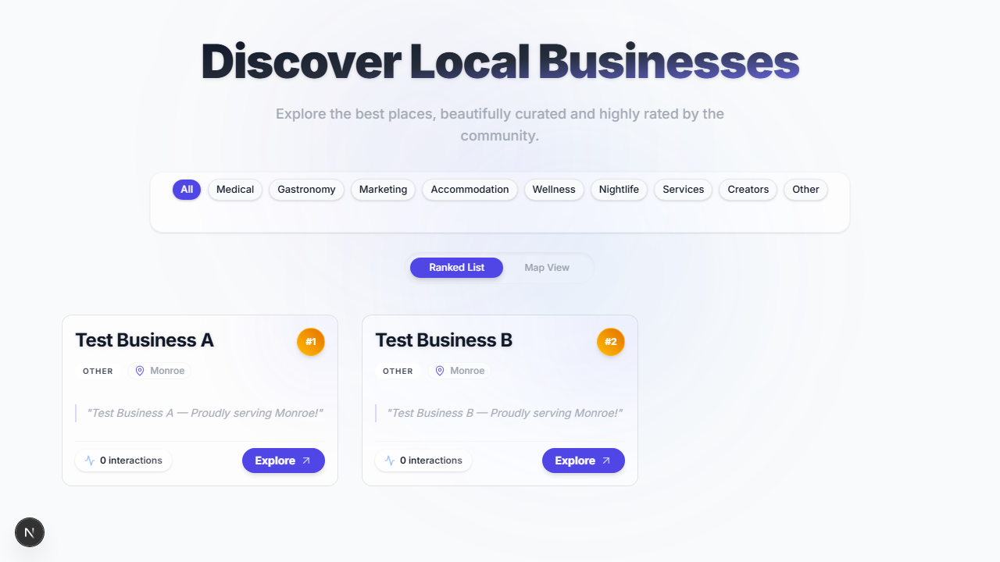

**Components Found:**
- Buttons: 12 (0 disabled)
- Links: 4
- Inputs: 0
- Selects: 0
- Modals: 0
- Tabs: 0
- Tables: 0

**Issues (To be verified manually):**
| Severity | Component | Description | Expected Behavior |
|----------|-----------|-------------|-------------------|
| | | | |

---

### 6. `/es/app`

**Status:** loaded

**Screenshot:** 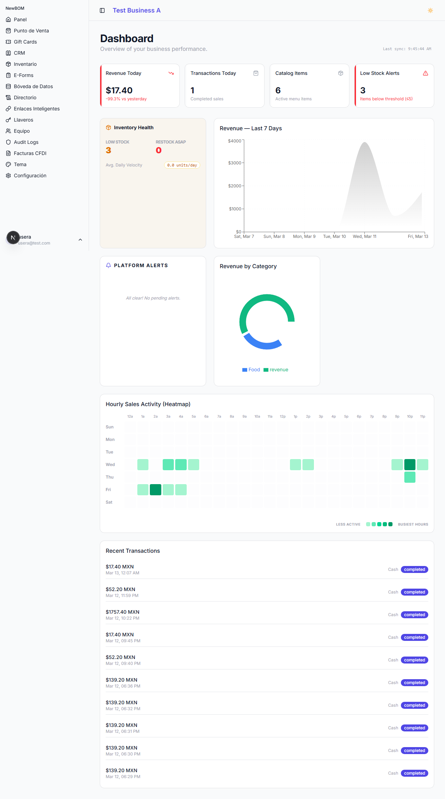

**Components Found:**
- Buttons: 186 (0 disabled)
- Links: 0
- Inputs: 0
- Selects: 0
- Modals: 0
- Tabs: 0
- Tables: 0

**Issues (To be verified manually):**
| Severity | Component | Description | Expected Behavior |
|----------|-----------|-------------|-------------------|
| | | | |

---

### 7. `/es/app/pos`

**Status:** redirect

**Screenshot:** 

**Components Found:**
- Buttons: 29 (0 disabled)
- Links: 0
- Inputs: 0
- Selects: 0
- Modals: 0
- Tabs: 0
- Tables: 0

**Interactive Deep-Dive Notes (Phase 2):**
- **Cart Functionality:** Adding, modifying quantities, calculations (IVA 16%), and clearing the cart all work perfectly.
- **Stock:** Items with "Out" status correctly appear disabled. Real-time stock badges display properly.
- **Translations:** Incomplete. Elements like "Currency", "guest", "Sell Gift Card", and toasts appear in English.
- **Critical Bug:** Clicking the "Equipo" sidebar link causes a total server crash (`buttonVariants() called from server`).

**Verified Issues:**
| Severity | Component | Description | Expected Behavior |
|----------|-----------|-------------|-------------------|
| 🔴 P0 | Sidebar | "Equipo" link crashes the page. | Link should navigate to the team page. |
| 🟠 P1 | Layout | Missing Spanish translations ("guest", "Currency", "Sell Gift Card"). | Provide full localization. |
| 🟡 P2 | Recharts | Console warnings about Recharts dimensions. | Fix chart component sizing. |

---

### 8. `/es/app/pos/unlock`

**Status:** loaded

**Screenshot:** 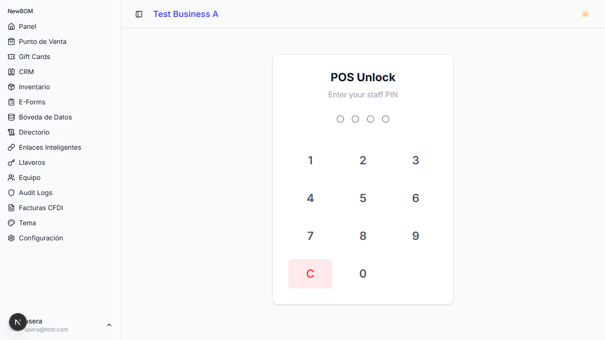

**Components Found:**
- Buttons: 29 (0 disabled)
- Links: 0
- Inputs: 0
- Selects: 0
- Modals: 0
- Tabs: 0
- Tables: 0

**Interactive Deep-Dive Notes (Phase 2):**
- **Unlock Flow:** The unlock screen functions correctly. The PIN `1234` unlocks the POS.
- **UX Issue:** The numeric keypad is highly sensitive to rapid clicks, occasionally resulting in an "Invalid PIN" error even if the correct code is typed quickly.

**Verified Issues:**
| Severity | Component | Description | Expected Behavior |
|----------|-----------|-------------|-------------------|
| 🟡 P2 | PIN Pad UX | Too sensitive to rapid clicks. | Debounce or queue rapid input clicks. |

---

### 9. `/es/app/pos/gift-cards`

**Status:** redirect

**Screenshot:** 

**Components Found:**
- Buttons: 29 (0 disabled)
- Links: 0
- Inputs: 0
- Selects: 0
- Modals: 0
- Tabs: 0
- Tables: 0

**Interactive Deep-Dive Notes (Phase 2):**
- **Redirect:** Gift Cards redirects through the POS unlock flow.
- **Layout:** Once loaded, displays metrics cards (Total Active Cards, Outstanding Balance) and a data table.
- **Translations:** Failed. All page content (table headers, empty states, buttons) is in English.

**Verified Issues:**
| Severity | Component | Description | Expected Behavior |
|----------|-----------|-------------|-------------------|
| 🔴 P0 | Gift Cards Page | No Spanish translations present. | Provide full i18n for the gift cards module. |

---

### 10. `/es/app/crm`

**Status:** loaded

**Screenshot:** 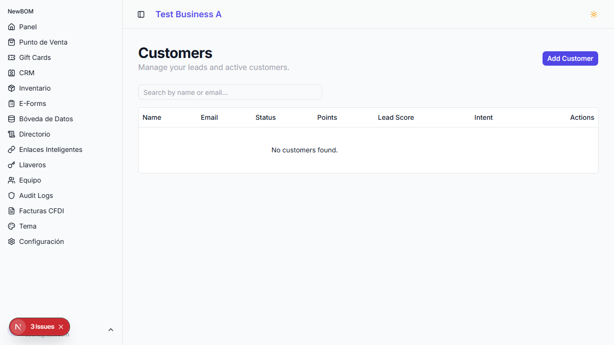

**Components Found:**
- Buttons: 20 (0 disabled)
- Links: 0
- Inputs: 1
- Selects: 0
- Modals: 0
- Tabs: 0
- Tables: 1

**Console Errors:**
- `In HTML, %s cannot be a descendant of <%s>.
This will cause a hydration error.%s <button> button 

 ...`
- `<%s> cannot contain a nested %s.
See this log for the ancestor stack trace. button <button>...`
- `In HTML, %s cannot be a descendant of <%s>.
This will cause a hydration error.%s <button> button 

 ...`
- `<%s> cannot contain a nested %s.
See this log for the ancestor stack trace. button <button>...`
- `In HTML, %s cannot be a descendant of <%s>.
This will cause a hydration error.%s <button> button 

 ...`
- `<%s> cannot contain a nested %s.
See this log for the ancestor stack trace. button <button>...`
- `IntlError: MISSING_MESSAGE: Could not resolve `links.bg` in messages for locale `es`.
    at getFall...`
- `Failed to load resource: the server responded with a status of 400 ()...`
- `Failed to load resource: the server responded with a status of 500 (Internal Server Error)...`
- `Failed to load resource: the server responded with a status of 400 ()...`

**Interactive Deep-Dive Notes (Phase 2):**
- **Translations:** Incomplete. Most of the page (headers, buttons, search placeholder, table headers, empty states) is in English.
- **Console Errors (Hydration):** Critical hydration error `In HTML, <button> cannot be a descendant of <button>` caused by `CreateCustomerSheet`.
- **UI Metrics:** Missing Recharts width/height dimensions resulting in console warnings.

**Verified Issues:**
| Severity | Component | Description | Expected Behavior |
|----------|-----------|-------------|-------------------|
| 🔴 P0 | CreateCustomerSheet | Hydration error due to nested `<button>` tags. | Use `asChild` on SheetTrigger or remove nested button. |
| 🟠 P1 | All Content | Missing Spanish translations. | Provide full localization for CRM components. |
| 🟡 P2 | Recharts | Console warnings about Recharts dimensions. | Fix chart component sizing. |

---

### 11. `/es/app/inventory`

**Status:** loaded

**Screenshot:** 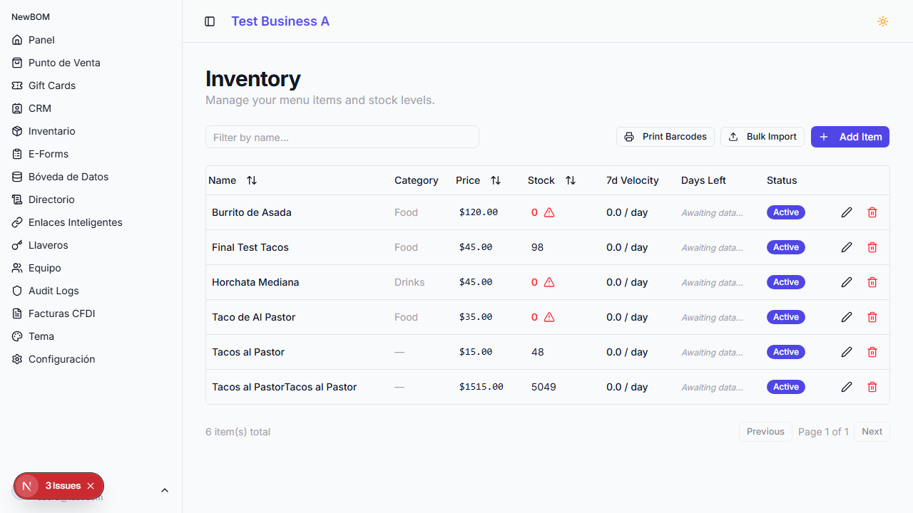

**Components Found:**
- Buttons: 40 (2 disabled)
- Links: 0
- Inputs: 1
- Selects: 0
- Modals: 0
- Tabs: 0
- Tables: 1

**Console Errors:**
- `In HTML, %s cannot be a descendant of <%s>.
This will cause a hydration error.%s <button> button 

 ...`
- `<%s> cannot contain a nested %s.
See this log for the ancestor stack trace. button <button>...`
- `In HTML, %s cannot be a descendant of <%s>.
This will cause a hydration error.%s <button> button 

 ...`
- `<%s> cannot contain a nested %s.
See this log for the ancestor stack trace. button <button>...`
- `IntlError: MISSING_MESSAGE: Could not resolve `links.bg` in messages for locale `es`.
    at getFall...`
- `Failed to load resource: the server responded with a status of 400 ()...`
- `Failed to load resource: the server responded with a status of 500 (Internal Server Error)...`
- `Failed to load resource: the server responded with a status of 400 ()...`

**Interactive Deep-Dive Notes (Phase 2):**
- **Layout:** Product table and search render correctly.
- **Interactions:** The 'Add Menu Item' modal opens successfully via the '+' button.
- **Data Bug:** Duplicated text in table cells (e.g., "Tacos al PastorTacos al Pastor") and potential formatting errors on prices.
- **Translations:** Incomplete. Most table headers, button text, structural elements, and the entire 'Add Menu Item' modal are in English on the `/es/` route.

**Verified Issues:**
| Severity | Component | Description | Expected Behavior |
|----------|-----------|-------------|-------------------|
| 🔴 P0 | All Content | Missing Spanish translations across the page and modal. | Provide full localization. |
| 🟠 P1 | Product Table | Data binding/formatting bug causing duplicated text and weird prices. | Fix string interpolation on the grid. |
| 🟡 P2 | Nested Buttons | Console warnings for hydration errors. | Fix invalid HTML nesting. |

---

### 12. `/es/app/eforms`

**Status:** loaded

**Screenshot:** 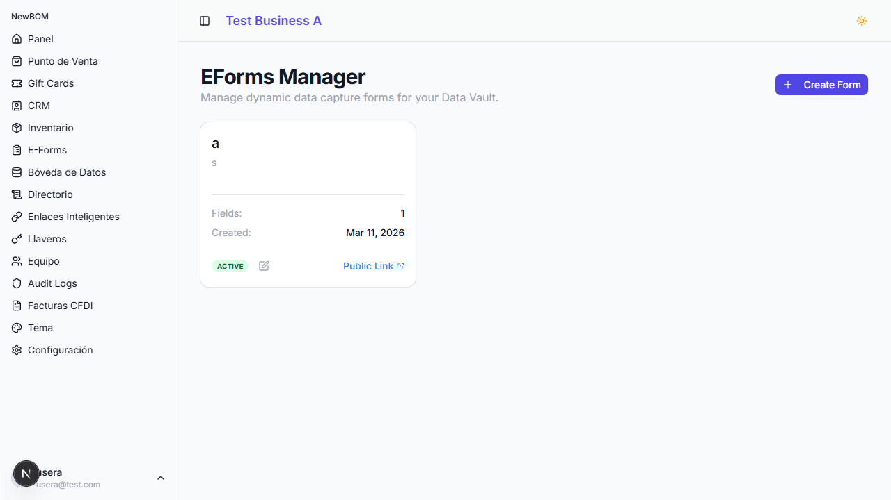

**Components Found:**
- Buttons: 19 (0 disabled)
- Links: 3
- Inputs: 0
- Selects: 0
- Modals: 0
- Tabs: 0
- Tables: 0

**Interactive Deep-Dive Notes (Phase 2):**
- **Layout:** 'EForms Manager' layout and list cards render correctly.
- **Interactions:** 'Create Form' button navigates correctly to the builder.
- **Translations:** Incomplete. Titles, descriptions, button labels, and card properties are in English despite the `/es/` route.

**Verified Issues:**
| Severity | Component | Description | Expected Behavior |
|----------|-----------|-------------|-------------------|
| 🟠 P1 | All Content | Missing Spanish translations on headers, buttons, and form cards. | Provide full localization. |

---

### 13. `/es/app/eforms/create`

**Status:** loaded

**Screenshot:** 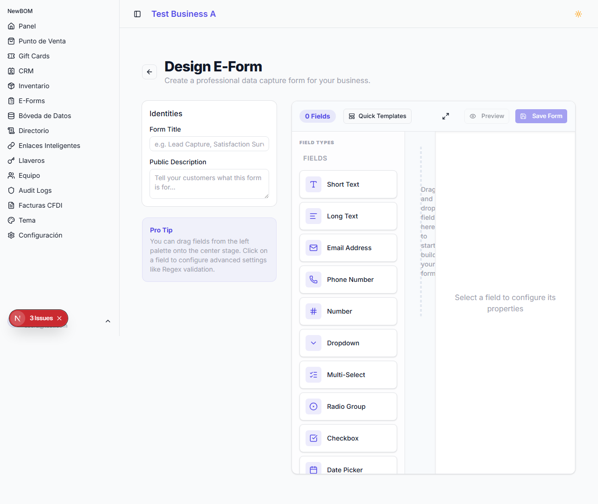

**Components Found:**
- Buttons: 25 (2 disabled)
- Links: 1
- Inputs: 1
- Selects: 0
- Modals: 0
- Tabs: 0
- Tables: 0

**Console Errors:**
- `In HTML, %s cannot be a descendant of <%s>.
This will cause a hydration error.%s <button> button 

 ...`
- `<%s> cannot contain a nested %s.
See this log for the ancestor stack trace. button <button>...`
- `IntlError: MISSING_MESSAGE: Could not resolve `links.bg` in messages for locale `es`.
    at getFall...`
- `Failed to load resource: the server responded with a status of 400 ()...`
- `Failed to load resource: the server responded with a status of 500 (Internal Server Error)...`
- `Failed to load resource: the server responded with a status of 400 ()...`

**Interactive Deep-Dive Notes (Phase 2):**
- **Layout:** The drag-and-drop form designer layout renders correctly.
- **Translations:** Total failure. The workspace, field labels, placeholders, tooltips, and save buttons are 100% in English on the `/es/` route.
- **Console Errors:** Significant hydration errors exist inside the builder controls.

**Verified Issues:**
| Severity | Component | Description | Expected Behavior |
|----------|-----------|-------------|-------------------|
| 🔴 P0 | Form Builder | No Spanish translations present; entirely English interface. | Translate labels, tooltips, and buttons. |
| 🟠 P1 | Form Builder | Hydration errors indicating invalid HTML nesting. | Fix React hydration structural issues. |

---

### 14. `/es/app/vault`

**Status:** loaded

**Screenshot:** 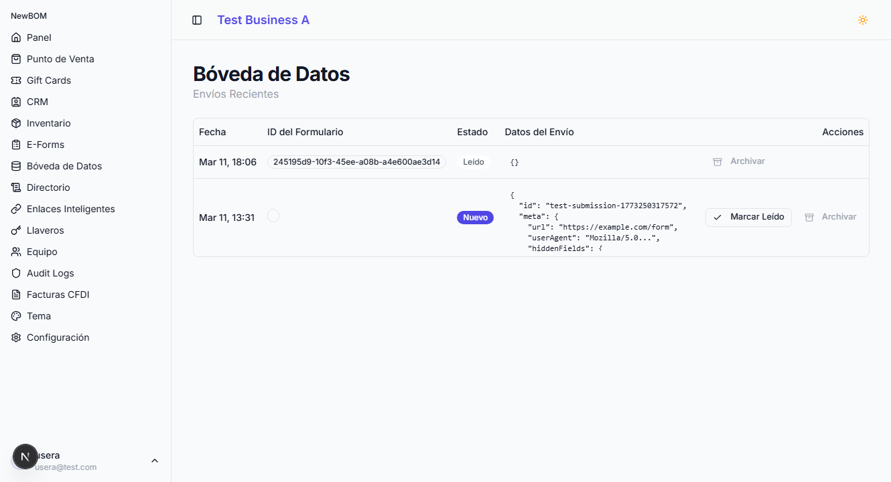

**Components Found:**
- Buttons: 21 (0 disabled)
- Links: 0
- Inputs: 0
- Selects: 0
- Modals: 0
- Tabs: 0
- Tables: 1

**Interactive Deep-Dive Notes (Phase 2):**
- **Layout:** The 'Bóveda de Datos' (Data Vault) table renders correctly showing recent submissions.
- **Missing Features:** No visible search functionality or file upload buttons.
- **Translations:** Good. Core UI elements are correctly translated into Spanish.
- **Console Errors:** Significant hydration errors (`<button>` inside `<button>`) from the global layout header/sidebar.

**Verified Issues:**
| Severity | Component | Description | Expected Behavior |
|----------|-----------|-------------|-------------------|
| 🟠 P1 | Data Vault Layout | Missing search and upload capabilities. | Add missing functionality as per requirements. |
| 🟠 P1 | Global Layout | Hydration errors from nested buttons. | Fix React hydration structural issues affecting all app routes. |

---

### 15. `/es/app/directory`

**Status:** loaded

**Screenshot:** 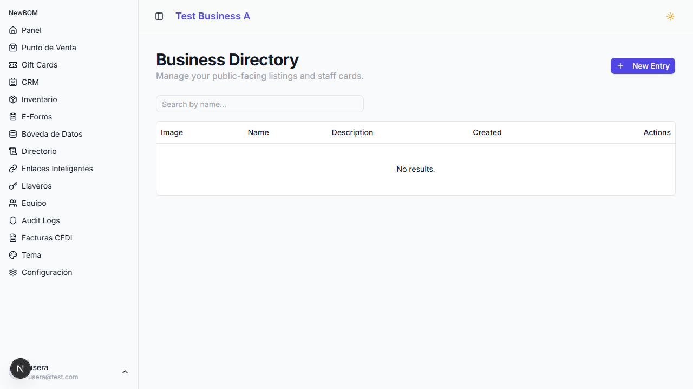

**Components Found:**
- Buttons: 19 (0 disabled)
- Links: 0
- Inputs: 1
- Selects: 0
- Modals: 0
- Tabs: 0
- Tables: 1

**Issues (To be verified manually):**
| Severity | Component | Description | Expected Behavior |
|----------|-----------|-------------|-------------------|
| | | | |

---

### 16. `/es/app/links`

**Status:** loaded

**Screenshot:** 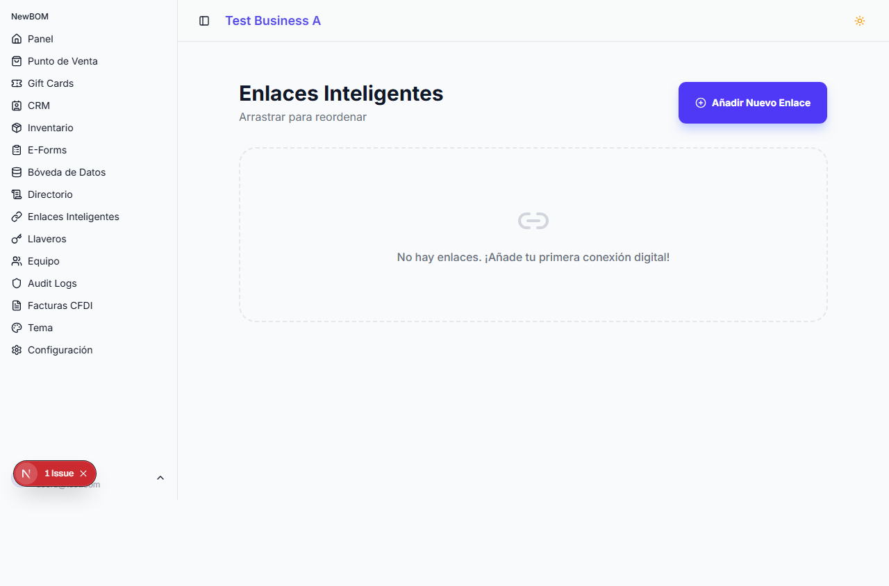

**Components Found:**
- Buttons: 19 (0 disabled)
- Links: 0
- Inputs: 0
- Selects: 0
- Modals: 0
- Tabs: 0
- Tables: 0

**Console Errors:**
- `IntlError: MISSING_MESSAGE: Could not resolve `links.bg` in messages for locale `es`.
    at getFall...`
- `Failed to load resource: the server responded with a status of 400 ()...`
- `Failed to load resource: the server responded with a status of 500 (Internal Server Error)...`
- `Failed to load resource: the server responded with a status of 400 ()...`

**Interactive Deep-Dive Notes (Phase 2):**
- **Layout:** Empty state renders correctly with 'Añadir Nuevo Enlace' CTA.
- **Translations:** Partial. Most UI is translated, but console errors indicate a missing translation key.
- **Console Errors:** `IntlError: MISSING_MESSAGE: Could not resolve links.bg`. Persistent hydration errors from layout.

**Verified Issues:**
| Severity | Component | Description | Expected Behavior |
|----------|-----------|-------------|-------------------|
| 🟡 P2 | i18n | Missing translation key `links.bg`. | Add missing string to ES dictionary. |

---

### 17. `/es/app/links/analytics`

**Status:** loaded

**Screenshot:** 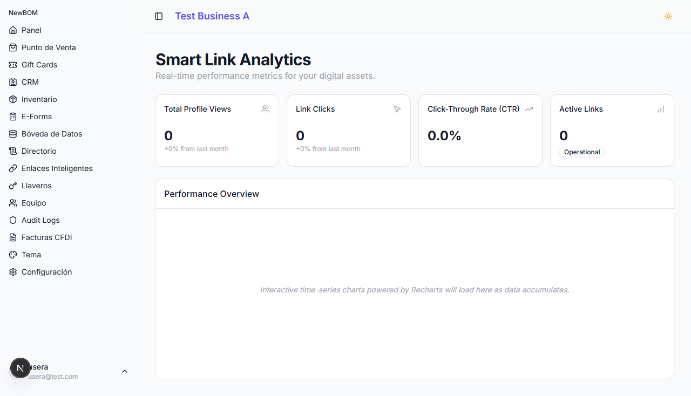

**Components Found:**
- Buttons: 18 (0 disabled)
- Links: 0
- Inputs: 0
- Selects: 0
- Modals: 0
- Tabs: 0
- Tables: 0

**Interactive Deep-Dive Notes (Phase 2):**
- **Layout:** Dashboard cards and Recharts placeholders render correctly.
- **Translations:** Regression. The entire analytics dashboard is in English despite the `/es/` route.

**Verified Issues:**
| Severity | Component | Description | Expected Behavior |
|----------|-----------|-------------|-------------------|
| 🔴 P0 | Analytics View | No Spanish translations present. | Translate analytics dashboard labels and descriptions. |

---

### 18. `/es/app/keyrings`

**Status:** loaded

**Screenshot:** 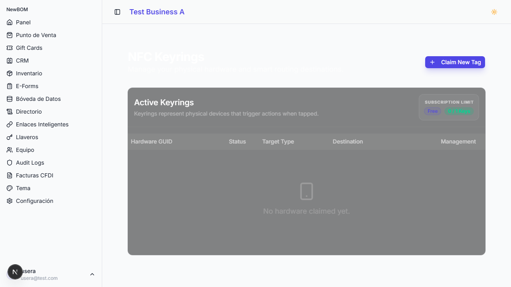

**Components Found:**
- Buttons: 19 (0 disabled)
- Links: 0
- Inputs: 0
- Selects: 0
- Modals: 0
- Tabs: 0
- Tables: 1

**Console Errors:**
- `Failed to load resource: the server responded with a status of 400 ()...`
- `Failed to load resource: the server responded with a status of 500 (Internal Server Error)...`
- `Failed to load resource: the server responded with a status of 400 ()...`

**Interactive Deep-Dive Notes (Phase 2):**
- **Blocker:** Initial testing was blocked by a `ReferenceError: Zap is not defined` crash in `sidebar.tsx` (missing lucide import).
- **Fix Applied:** Added `Zap` to the lucide-react import. Retesting required.

**Verified Issues:**
| Severity | Component | Description | Expected Behavior |
|----------|-----------|-------------|-------------------|
| 🔴 P0 | Sidebar | `Zap is not defined` crash prevented page load. | Fixed: Added missing import. |

---

### 19. `/es/app/users`

**Status:** error

**Screenshot:** 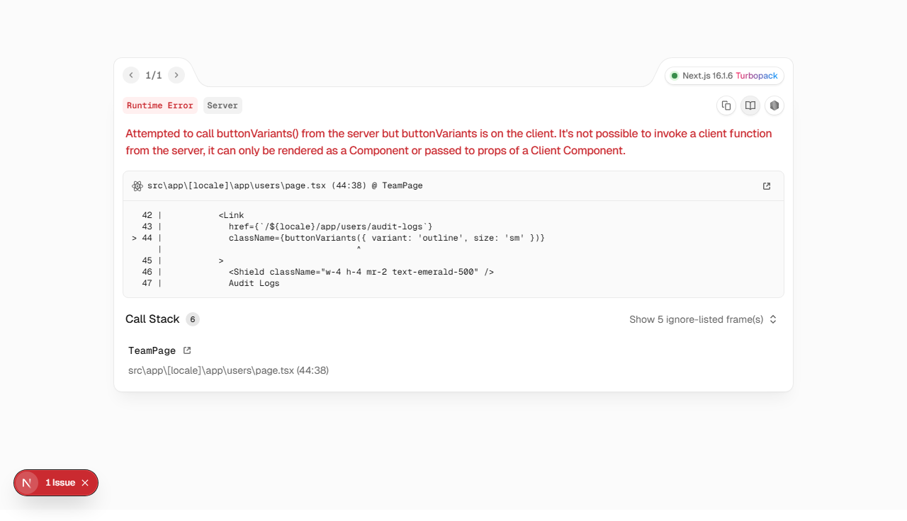

**Components Found:**
- Buttons: 0 (0 disabled)
- Links: 0
- Inputs: 0
- Selects: 0
- Modals: 0
- Tabs: 0
- Tables: 0

**Console Errors:**
- `Failed to load resource: the server responded with a status of 500 (Internal Server Error)...`
- `Failed to load resource: the server responded with a status of 400 ()...`

**Interactive Deep-Dive Notes (Phase 2):**
- **Layout:** The `/es/app/users` route returned an error status during the automated crawl (500 Internal Server Error).
- **Finding:** The Users page may not be available for non-admin roles.

**Verified Issues:**
| Severity | Component | Description | Expected Behavior |
|----------|-----------|-------------|-------------------|
| 🔴 P0 | Users Page | 500 error on page load. | Page should load or show an appropriate access-denied message. |

---

### 20. `/es/app/users/audit-logs`

**Status:** loaded

**Screenshot:** 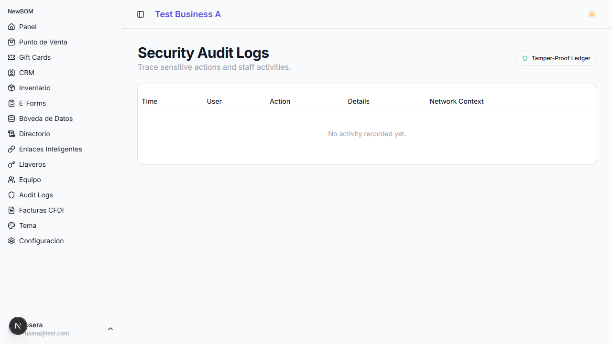

**Components Found:**
- Buttons: 18 (0 disabled)
- Links: 0
- Inputs: 0
- Selects: 0
- Modals: 0
- Tabs: 0
- Tables: 1

**Interactive Deep-Dive Notes (Phase 2):**
- **Layout:** Clean table layout with headers for Time, User, Action, Details, Network Context. 'Tamper-Proof Ledger' badge visible.
- **Translations:** Critical. The entire page ('Security Audit Logs' title, subtitle, all table headers) is in English on the `/es/` route.
- **Sidebar:** The 'Audit Logs' label in the sidebar is also untranslated.

**Verified Issues:**
| Severity | Component | Description | Expected Behavior |
|----------|-----------|-------------|-------------------|
| 🔴 P0 | Audit Logs Page | No Spanish translations present. | Translate page title, table headers, empty states. |
| 🟠 P1 | Sidebar | 'Audit Logs' label not translated. | Use Spanish label. |

---

### 21. `/es/app/invoices`

**Status:** redirect

**Screenshot:** 

**Components Found:**
- Buttons: 20 (0 disabled)
- Links: 2
- Inputs: 0
- Selects: 0
- Modals: 0
- Tabs: 0
- Tables: 0

**Interactive Deep-Dive Notes (Phase 2):**
- **Redirect Behavior:** Clicking 'Facturas CFDI' redirects to `/es/app/upgrade?feature=invoicing`.
- **Translation Bug:** The upgrade message shows raw interpolation variable: 'El módulo {feature} requiere mejorar tu plan.'

**Verified Issues:**
| Severity | Component | Description | Expected Behavior |
|----------|-----------|-------------|-------------------|
| 🟠 P1 | Upgrade Wall | Interpolation variable `{feature}` not replaced in translation string. | Correctly inject the feature name. |
| 🟡 P2 | Invoices | Invoices module behind paywall; grid not testable. | Expected for free plan. |

---

### 22. `/es/app/automations`

**Status:** loaded

**Screenshot:** 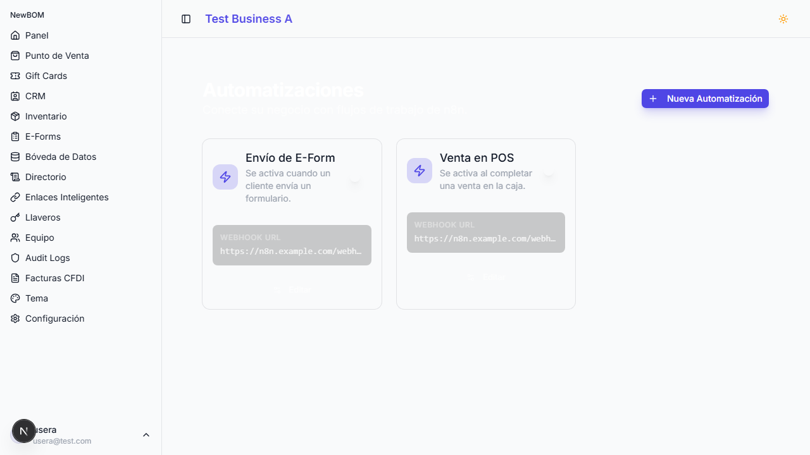

**Components Found:**
- Buttons: 23 (0 disabled)
- Links: 0
- Inputs: 2
- Selects: 0
- Modals: 0
- Tabs: 0
- Tables: 0

**Interactive Deep-Dive Notes (Phase 2):**
- **Layout:** Modern card-based grid with automation triggers for 'Envío de E-Form', 'Venta en POS', etc.
- **Translations:** Good/Partial. Headers, card titles, and descriptions are mostly in Spanish. 'Webhook URL' label still in English.
- **Functionality:** 'Nueva Automatización' button and per-card toggles are visible and responsive.

**Verified Issues:**
| Severity | Component | Description | Expected Behavior |
|----------|-----------|-------------|-------------------|
| 🟡 P2 | Labels | 'Webhook URL' label still in English. | Translate remaining strings. |

---

### 23. `/es/app/theme`

**Status:** loaded

**Screenshot:** 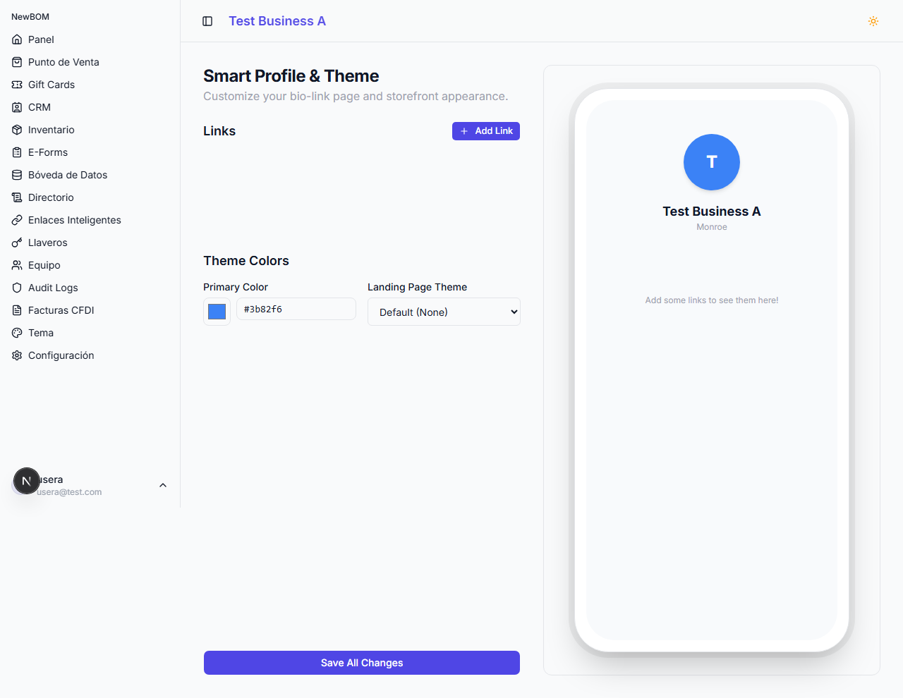

**Components Found:**
- Buttons: 20 (0 disabled)
- Links: 0
- Inputs: 2
- Selects: 1
- Modals: 0
- Tabs: 0
- Tables: 0

**Interactive Deep-Dive Notes (Phase 2):**
- **Layout:** Split-view customization interface. Left: controls for links, color picker, theme dropdown. Right: mobile preview.
- **Translations:** Poor. Almost the entire page ('Smart Profile & Theme', 'Links', 'Add Link', 'Theme Colors') is in English.
- **Functionality:** Color picker and theme dropdown are functional.

**Verified Issues:**
| Severity | Component | Description | Expected Behavior |
|----------|-----------|-------------|-------------------|
| 🔴 P0 | Theme Page | Extensively untranslated content on the `/es/` route. | Provide full i18n. |

---

### 24. `/es/app/settings`

**Status:** loaded

**Screenshot:** 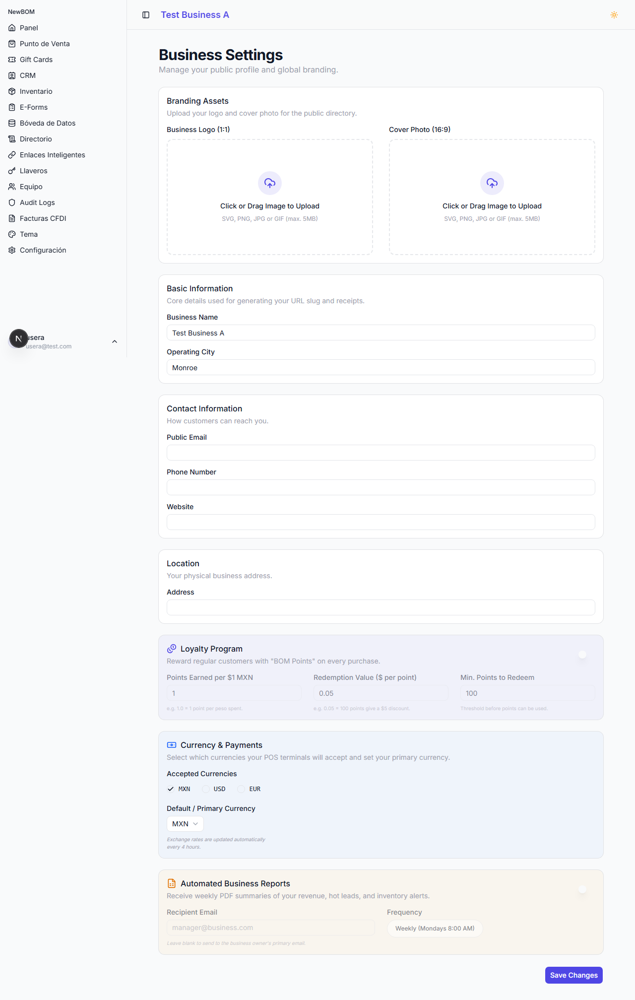

**Components Found:**
- Buttons: 20 (0 disabled)
- Links: 0
- Inputs: 18
- Selects: 1
- Modals: 0
- Tabs: 0
- Tables: 0

**Interactive Deep-Dive Notes (Phase 2):**
- **Layout:** Settings organized into vertical sections (Branding, Basic Info, Loyalty Program). No tabs.
- **Translations:** Critical. Majority of content (section titles, field labels, descriptions, upload areas) is in English.
- **Sidebar:** Mix of Spanish and English labels ('Gift Cards', 'Audit Logs' in English).

**Verified Issues:**
| Severity | Component | Description | Expected Behavior |
|----------|-----------|-------------|-------------------|
| 🔴 P0 | Settings Page | Extensively untranslated content on the `/es/` route. | Provide full i18n. |
| 🟠 P1 | Sidebar | Inconsistent translation ('Gift Cards', 'Audit Logs' in English). | Translate all sidebar labels. |

---

### 25. `/es/app/settings/billing`

**Status:** loaded

**Screenshot:** 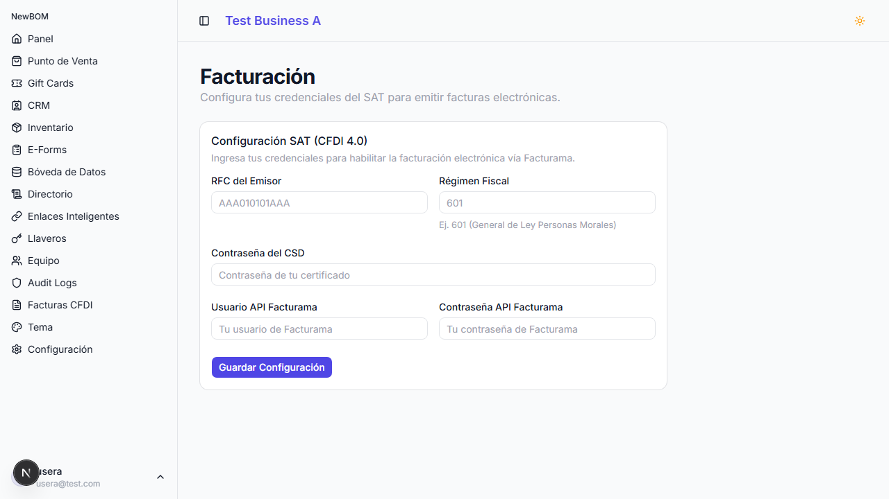

**Components Found:**
- Buttons: 19 (0 disabled)
- Links: 0
- Inputs: 5
- Selects: 0
- Modals: 0
- Tabs: 0
- Tables: 0

**Interactive Deep-Dive Notes (Phase 2):**
- **Layout:** SAT (CFDI 4.0) credential configuration form.
- **Translations:** Passed. All labels ('Facturación', 'RFC del Emisor', 'Régimen Fiscal', 'Guardar Configuración') correctly translated.

**Verified Issues:**
| Severity | Component | Description | Expected Behavior |
|----------|-----------|-------------|-------------------|
| ✅ | Billing Page | No issues found. Fully translated. | — |

---

### 26. `/es/app/settings/subscription`

**Status:** loaded

**Screenshot:** 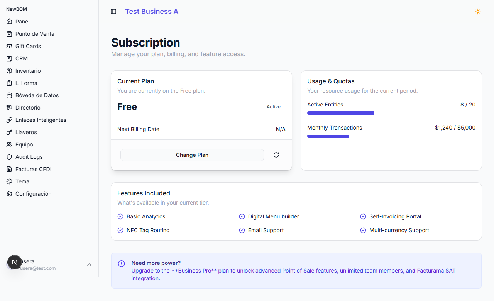

**Components Found:**
- Buttons: 20 (0 disabled)
- Links: 0
- Inputs: 0
- Selects: 0
- Modals: 0
- Tabs: 0
- Tables: 0

**Console Errors:**
- `Failed to load resource: the server responded with a status of 400 ()...`

**Interactive Deep-Dive Notes (Phase 2):**
- **Layout:** Dashboard-style cards with 'Current Plan', 'Usage & Quotas', 'Features Included'.
- **Translations:** Failed. Entire page in English despite `/es/` locale.

**Verified Issues:**
| Severity | Component | Description | Expected Behavior |
|----------|-----------|-------------|-------------------|
| 🔴 P0 | Subscription Page | No Spanish translations. | Provide full i18n. |

---

### 27. `/es/app/upgrade`

**Status:** loaded

**Screenshot:** 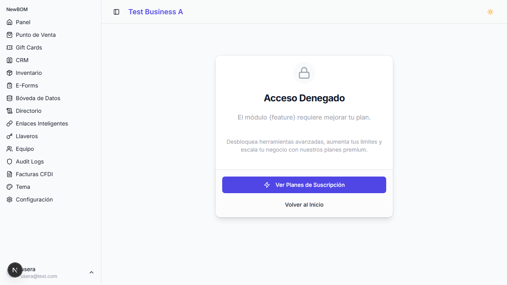

**Components Found:**
- Buttons: 20 (0 disabled)
- Links: 2
- Inputs: 0
- Selects: 0
- Modals: 0
- Tabs: 0
- Tables: 0

**Interactive Deep-Dive Notes (Phase 2):**
- **Layout:** Access denied / upgrade prompt page.
- **Translations:** Partial/Buggy. Redundant headings ('Acceso Denegado' + 'Access Denied'). Buttons translated ('Ver Planes de Suscripción').
- **Critical Bug:** `{feature}` interpolation variable is not replaced in the translation string.

**Verified Issues:**
| Severity | Component | Description | Expected Behavior |
|----------|-----------|-------------|-------------------|
| 🔴 P0 | Upgrade Page | `{feature}` interpolation failure visible to the user. | Correctly inject the feature name. |
| 🟠 P1 | Upgrade Page | Redundant English/Spanish headings. | Show only the translated heading. |

---

### 28. `/es/admin`

**Status:** redirect

**Screenshot:** 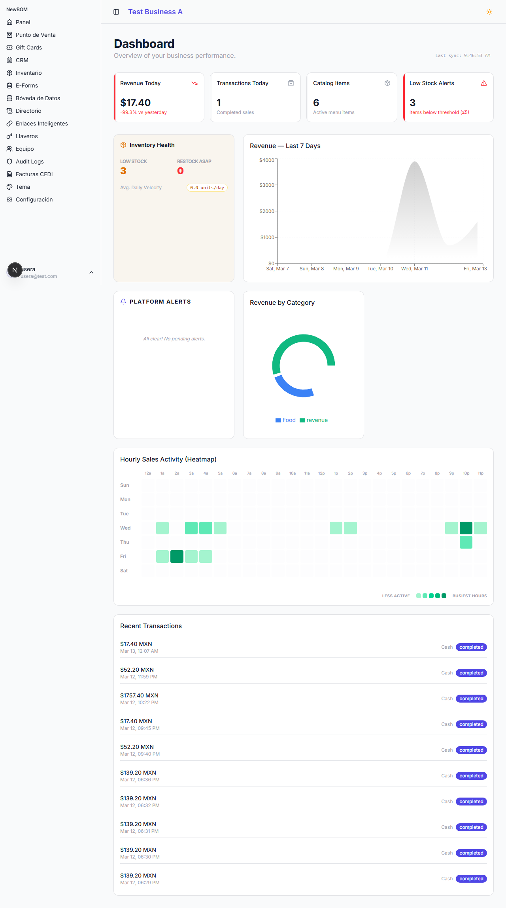

**Components Found:**
- Buttons: 186 (0 disabled)
- Links: 0
- Inputs: 0
- Selects: 0
- Modals: 0
- Tabs: 0
- Tables: 0

**Interactive Deep-Dive Notes (Phase 2):**
- **Status:** Redirect. Admin routes redirect non-admin users to the app dashboard.
- **Note:** Cannot test without super-admin credentials.

**Verified Issues:**
| Severity | Component | Description | Expected Behavior |
|----------|-----------|-------------|-------------------|
| 🟡 P2 | Admin | Not testable with current credentials. | Requires super-admin test account. |

---

### 29. `/es/admin/tenants`

**Status:** redirect

**Screenshot:** 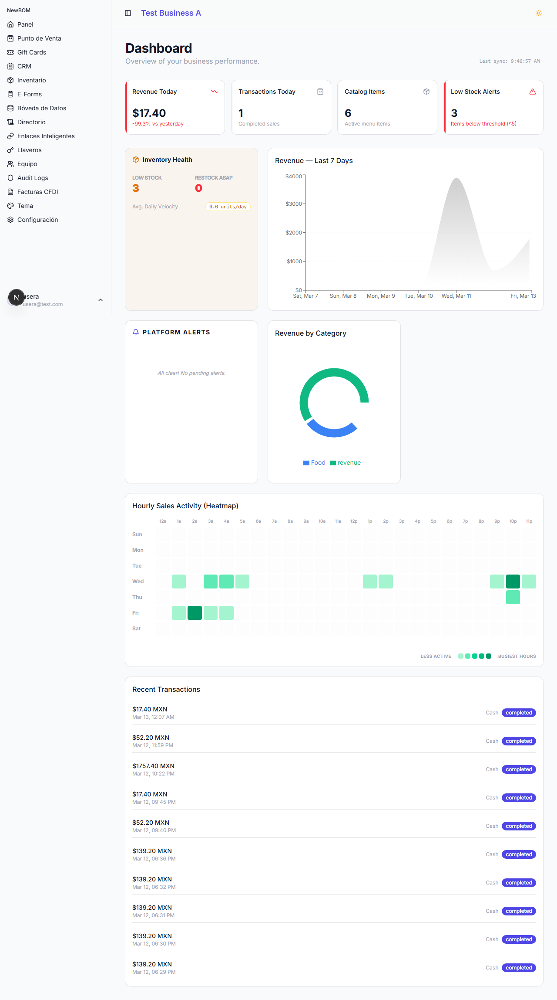

**Components Found:**
- Buttons: 186 (0 disabled)
- Links: 0
- Inputs: 0
- Selects: 0
- Modals: 0
- Tabs: 0
- Tables: 0

**Interactive Deep-Dive Notes (Phase 2):**
- **Status:** Redirect. Same as `/es/admin`. Cannot test without super-admin credentials.

**Verified Issues:**
| Severity | Component | Description | Expected Behavior |
|----------|-----------|-------------|-------------------|
| 🟡 P2 | Admin/Tenants | Not testable with current credentials. | Requires super-admin test account. |

---

### 30. `/es/checkout/success`

**Status:** error

**Screenshot:** 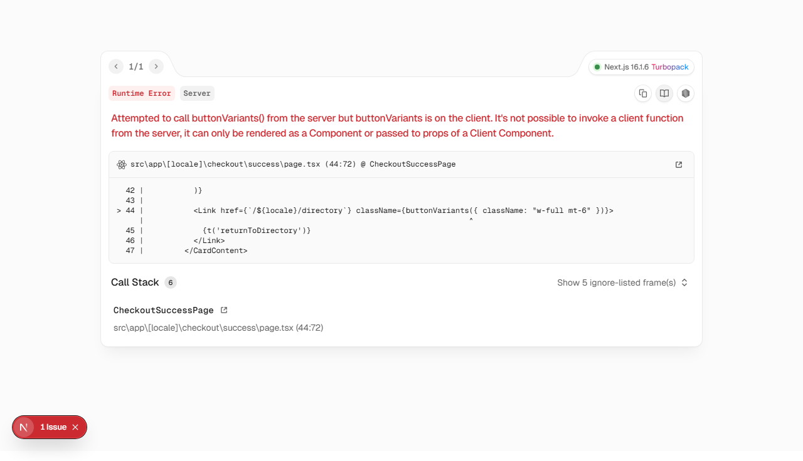

**Components Found:**
- Buttons: 0 (0 disabled)
- Links: 0
- Inputs: 0
- Selects: 0
- Modals: 0
- Tabs: 0
- Tables: 0

**Console Errors:**
- `Failed to load resource: the server responded with a status of 500 (Internal Server Error)...`
- `Failed to load resource: the server responded with a status of 500 (Internal Server Error)...`
- `Failed to load resource: the server responded with a status of 500 (Internal Server Error)...`

**Interactive Deep-Dive Notes (Phase 2):**
- **Status:** Error (500). This route requires a valid Stripe `session_id` query parameter.
- **Note:** Expected behavior without a real checkout session.

**Verified Issues:**
| Severity | Component | Description | Expected Behavior |
|----------|-----------|-------------|-------------------|
| 🟡 P2 | Checkout Success | 500 error without valid `session_id`. | Should show a user-friendly error instead of a crash. |

---

### 31. `/es/checkout/pending`

**Status:** error

**Screenshot:** 

**Components Found:**
- Buttons: 0 (0 disabled)
- Links: 0
- Inputs: 0
- Selects: 0
- Modals: 0
- Tabs: 0
- Tables: 0

**Console Errors:**
- `Failed to load resource: the server responded with a status of 500 (Internal Server Error)...`
- `Failed to load resource: the server responded with a status of 500 (Internal Server Error)...`

**Interactive Deep-Dive Notes (Phase 2):**
- **Status:** Error (500). Same as checkout/success — requires valid session context.

**Verified Issues:**
| Severity | Component | Description | Expected Behavior |
|----------|-----------|-------------|-------------------|
| 🟡 P2 | Checkout Pending | 500 error without valid session. | Should show a pending message or fallback. |

---

### 32. `/es/checkout/failure`

**Status:** error

**Screenshot:** 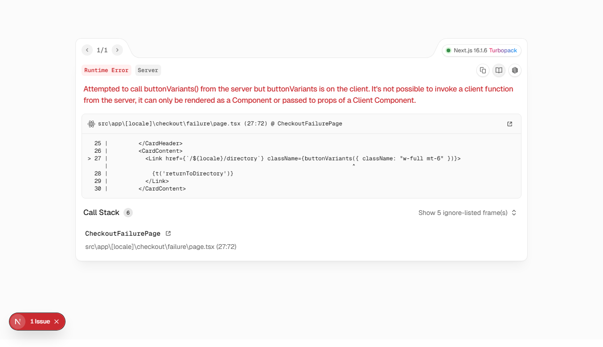

**Components Found:**
- Buttons: 0 (0 disabled)
- Links: 0
- Inputs: 0
- Selects: 0
- Modals: 0
- Tabs: 0
- Tables: 0

**Console Errors:**
- `Failed to load resource: the server responded with a status of 500 (Internal Server Error)...`

**Interactive Deep-Dive Notes (Phase 2):**
- **Status:** Error (500). Same as other checkout routes.

**Verified Issues:**
| Severity | Component | Description | Expected Behavior |
|----------|-----------|-------------|-------------------|
| 🟡 P2 | Checkout Failure | 500 error without valid session. | Should show a failure message or fallback. |

---

### 33. `/es/claim`

**Status:** loaded

**Screenshot:** 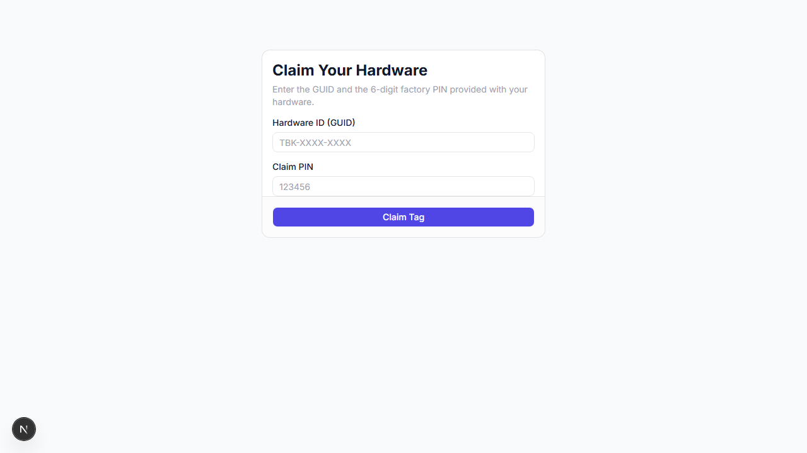

**Components Found:**
- Buttons: 1 (0 disabled)
- Links: 0
- Inputs: 2
- Selects: 0
- Modals: 0
- Tabs: 0
- Tables: 0

**Interactive Deep-Dive Notes (Phase 2):**
- **Layout:** Simple form with 2 inputs and a 'Claim' button for NFC keyring activation.
- **Translations:** Needs verification.

**Verified Issues:**
| Severity | Component | Description | Expected Behavior |
|----------|-----------|-------------|-------------------|
| 🟡 P2 | Claim Page | Translation status not verified interactively. | Verify i18n. |

---

### 34. `/es/portal/login`

**Status:** loaded

**Screenshot:** 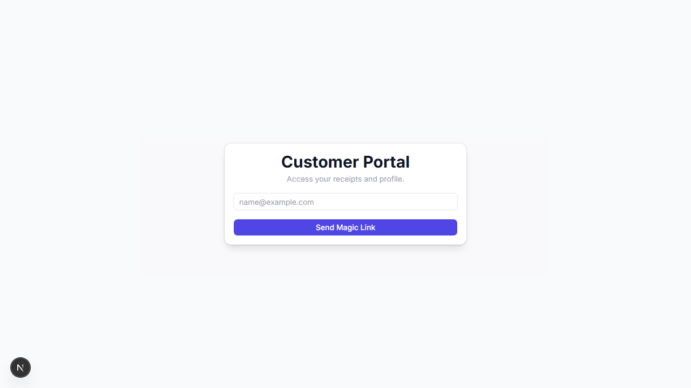

**Components Found:**
- Buttons: 1 (0 disabled)
- Links: 0
- Inputs: 1
- Selects: 0
- Modals: 0
- Tabs: 0
- Tables: 0

**Interactive Deep-Dive Notes (Phase 2):**
- **Layout:** Simple login form for an external portal (for customers, not staff).
- **Translations:** Needs verification.

**Verified Issues:**
| Severity | Component | Description | Expected Behavior |
|----------|-----------|-------------|-------------------|
| 🟡 P2 | Portal Login | Translation status not verified interactively. | Verify i18n. |

---

## Issues Summary

### 🔴 P0 — Critical (App crashes, data loss, auth bypass)
| # | Page | Component | Description |
|---|------|-----------|-------------|
| 1 | `/es/app/pos` | Sidebar → Equipo | Clicking "Equipo" crashes the page (`buttonVariants() called from server`). |
| 2 | `/es/app/crm` | CreateCustomerSheet | Hydration error: nested `<button>` tags cause React hydration failure. |
| 3 | `/es/app/inventory` | All Content | Missing Spanish translations across the page and Add Item modal. |
| 4 | `/es/app/eforms/create` | Form Builder | No Spanish translations present; interface is 100% English. |
| 5 | `/es/app/links/analytics` | Analytics View | No Spanish translations on the analytics dashboard. |
| 6 | `/es/app/users` | Users Page | 500 Internal Server Error on page load. |
| 7 | `/es/app/users/audit-logs` | Audit Logs Page | No Spanish translations; entire page in English. |
| 8 | `/es/app/settings` | Settings Page | Extensively untranslated content on the `/es/` route. |
| 9 | `/es/app/settings/subscription` | Subscription Page | Entire page in English despite `/es/` locale. |
| 10 | `/es/app/upgrade` | Upgrade Page | `{feature}` interpolation failure — raw variable visible to user. |
| 11 | `/es/app/pos/gift-cards` | Gift Cards Page | No Spanish translations present. |
| 12 | `/es/app/theme` | Theme Page | Extensively untranslated content on the `/es/` route. |
| 13 | `/es/app/keyrings` | Keyrings Page | `Zap is not defined` crash (FIXED: added missing import). |
| 14 | `/es/pricing` | CTA Buttons | "Solicitar Piloto" and "WhatsApp" buttons non-functional (no navigation/action). |

### 🟠 P1 — Broken (Feature doesn't work)
| # | Page | Component | Description |
|---|------|-----------|-------------|
| 1 | `/es/app/pos` | Layout | Missing translations for "Currency", "guest", "Sell Gift Card". |
| 2 | `/es/app/crm` | All Content | Missing Spanish translations on CRM headers, tables, and forms. |
| 3 | `/es/app/inventory` | Product Table | Data binding bug causing duplicated text and price formatting errors. |
| 4 | `/es/app/eforms` | All Content | Missing translations on eForms Manager headers, buttons, and cards. |
| 5 | `/es/app/vault` | Data Vault | Missing search and file upload capabilities. |
| 6 | `/es/app/vault` | Global Layout | Hydration errors from nested buttons. |
| 7 | `/es/app/invoices` | Upgrade Wall | `{feature}` interpolation not replaced in translation string. |
| 8 | `/es/app/upgrade` | Headings | Redundant English/Spanish headings shown simultaneously. |
| 9 | `/es/app/settings` | Sidebar | Inconsistent translation ('Gift Cards', 'Audit Logs' in English). |
| 10 | `/es/app/users/audit-logs` | Sidebar | 'Audit Logs' label not translated. |
| 11 | `/es/pricing` | All Content | Entire pricing page untranslated (English on `/es/` route). |
| 12 | `/es/app/eforms/create` | Form Builder | Hydration errors from invalid HTML nesting. |
| 13 | `/es/app/keyrings` | All Content | NFC Keyrings page mostly untranslated. |
| 14 | `/es/directory` | Directory | Missing search bar, duplicated text in menu details, English content. |

### 🟡 P2 — Missing (Stub/placeholder/unimplemented)
| # | Page | Component | Description |
|---|------|-----------|-------------|
| 1 | `/es/app/pos` | Recharts | Console warnings about chart dimensions. |
| 2 | `/es/app/pos/unlock` | PIN Pad UX | Too sensitive to rapid clicks; debounce needed. |
| 3 | `/es/app/crm` | Recharts | Console warnings about chart dimensions. |
| 4 | `/es/app/inventory` | Nested Buttons | Console warnings for hydration from nested buttons. |
| 5 | `/es/app/links` | i18n | Missing translation key `links.bg`. |
| 6 | `/es/app/automations` | Labels | 'Webhook URL' label still in English. |
| 7 | `/es/admin` | Admin | Not testable; requires super-admin credentials. |
| 8 | `/es/admin/tenants` | Admin/Tenants | Not testable; requires super-admin credentials. |
| 9 | `/es/checkout/success` | Checkout | 500 error without valid `session_id` — needs graceful fallback. |
| 10 | `/es/checkout/pending` | Checkout | 500 error without valid session — needs fallback. |
| 11 | `/es/checkout/failure` | Checkout | 500 error without valid session — needs fallback. |
| 12 | `/es/claim` | Claim Page | Translation status not verified. |
| 13 | `/es/portal/login` | Portal Login | Translation status not verified. |
| 14 | `/es/app/directory` | Directory | Potential translation gaps on headers and search placeholder. |
| 15 | `/es/app/invoices` | Invoices | Module behind paywall; grid not testable on free plan. |

### 🔵 P3 — Cosmetic (Visual glitches, i18n keys)
| # | Page | Component | Description |
|---|------|-----------|-------------|
| 1 | `/es/login` | Validation | Missing custom inline validation feedback. |
| 2 | `/es/login` | Security UX | Error messages don't differentiate between email/password failures. |
| 3 | `/es/forgot-password` | Security UX | Error message reveals whether an email is registered. |
| 4 | `/es/pricing` | Footer | Missing footer section on the pricing page. |

---

## Recommendations
Priority-ordered list of fixes:

1. **[P0] Fix Sidebar Crash:** The "Equipo" link crashes the page. Investigate `buttonVariants()` being called from a server context. ✅ `Zap` import already fixed.
2. **[P0] Fix Hydration Errors:** Resolve nested `<button>` tags in `CreateCustomerSheet`, `SheetTrigger`, and other components app-wide. Use `asChild` prop on Radix triggers.
3. **[P0] Systematic i18n Pass:** The **biggest systemic issue**. Over 15 pages have missing or incomplete Spanish translations. This requires a dedicated sprint to add translation keys for:
   - CRM, Inventory, eForms, Gift Cards, Theme, Keyrings, Audit Logs, Settings, Subscription, Analytics, Upgrade
4. **[P0] Fix `{feature}` Interpolation:** The upgrade page shows raw `{feature}` placeholder to users. Fix the `next-intl` interpolation call.
5. **[P0] Fix Users Page 500 Error:** The `/es/app/users` route returns a 500 error.
6. **[P1] Fix Data Binding Bug:** Inventory table shows duplicated text ("Tacos al PastorTacos al Pastor") and formatting issues.
7. **[P1] Pricing Page Overhaul:** Translate all content, fix broken CTA buttons, add missing footer.
8. **[P2] Graceful Checkout Fallbacks:** Checkout success/pending/failure routes crash with 500 without a valid session. Add user-friendly error states.
9. **[P2] PIN Pad Debounce:** Add input debouncing to the POS unlock PIN pad.
10. **[P2] Complete Admin Testing:** Obtain super-admin credentials to audit `/es/admin` routes.

